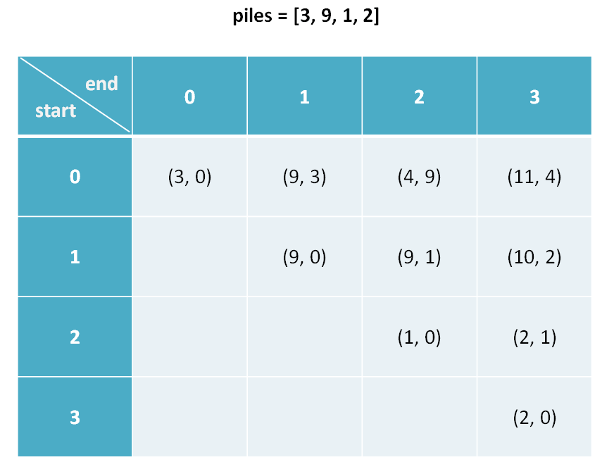
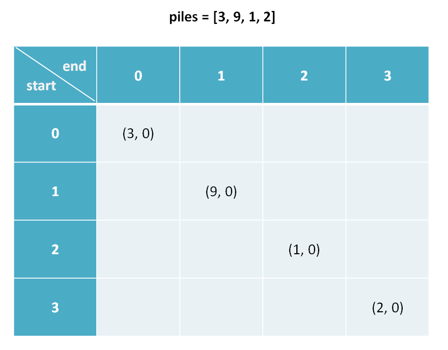
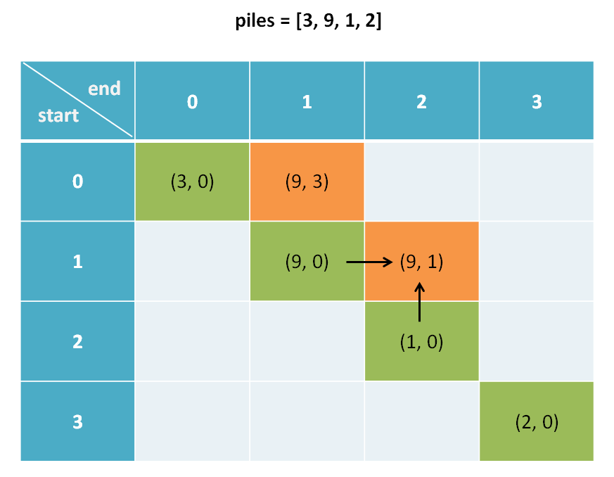
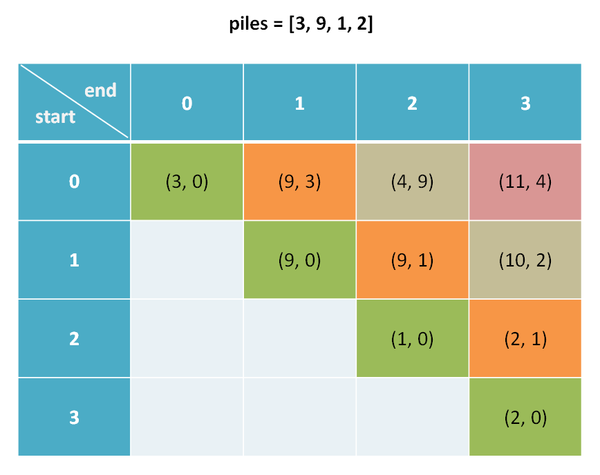

# 博弈问题

```typescript
/*
leecode:
877.石子游戏（中等）
*/
```

你和你的朋友面前有一排石头堆，用一个数组 piles 表示，piles[i] 表示第 i 堆石子有多少个。你们轮流拿石头，一次拿一堆，但是只能拿走最左边或者最右边的石头堆。所有石头被拿完后，谁拥有的石头多，谁获胜。

石头的堆数可以是任意正整数，石头的总数也可以是任意正整数，这样就能打破先手必胜的局面了。比如有三堆石头 piles = [1, 100, 3]，先手不管拿 1 还是 3，能够决定胜负的 100 都会被后手拿走，后手会获胜。

**假设两人都很聪明**，请你设计一个算法，返回先手和后手的最后得分（石头总数）之差。比如上面那个例子，先手能获得 4 分，后手会获得 100 分，你的算法应该返回 -96。

这样推广之后，这个问题算是一道 Hard 的动态规划问题了。**博弈问题的难点在于，两个人要轮流进行选择，而且都贼精明，应该如何编程表示这个过程呢**？

还是强调多次的套路，首先明确 dp 数组的含义，然后和股票买卖系列问题类似，只要找到「状态」和「选择」，一切就水到渠成了。

## 定义 dp 数组

先看看 dp 数组最终的样子：



将元祖 first 和 second 简写为 fir 和 sec，比如上图 dp[1][3].fir=10,dp[0][1].sec=3.

**对 dp 数组含义的解释**：

```typescript
dp[i][j].fir 表示，对于 piles[i...j] 这部分石头堆，先手能获得的最高分数。
dp[i][j].sec 表示，对于 piles[i...j] 这部分石头堆，后手能获得的最高分数。

举例理解一下，假设 piles = [3, 9, 1, 2]，索引从 0 开始
dp[0][1].fir = 9 意味着：面对石头堆 [3, 9]，先手最终能够获得 9 分。
dp[1][3].sec = 2 意味着：面对石头堆 [9, 1, 2]，后手最终能够获得 2 分。
```

我们想求的答案是先手和后手最终分数之差，按照这个定义也就是 dp[0][n-1].fir - dp[0][n-1].sec，即面对整个 piles，先手的最优得分和后手的最优得分之差。

## 状态转移方程

根据前面对 dp 数组的定义，状态显然有三个：**开始的索引 i，结束的索引 j，当前轮到的人**。

```typescript
dp[i][j][fir of sec]

其中：

0 <= i < piles.length
i <= j < piles.length
```

对于这个问题的每个状态，可以做的**选择有两个：选择最左边的那堆石头，或者选择最右边的那堆石头**。我们可以这样穷举所有状态：

```typescript
n = piles.length
for 0 <= i < n:
    for j <= i < n:
        for who in {fir, sec}:
            dp[i][j][who] = max(left, right)
```

这道题的难点在于，两人是交替进行选择的，也就是说先手的选择会对后手有影响，这怎么表达出来呢？

状态转移方程：

```typescript
dp[i][j].fir = Math.max(
  piles[i] + dp[i + 1][j].sec, // 选择最左边的石头堆，
  piles[j] + dp[i][j - 1].sec, // 选择最右边的石头堆
);
/*
解释：我作为先手，面对 piles[i...j] 时，有两种选择：
要么我选择最左边的那一堆石头，然后面对 piles[i+1...j]
但是此时轮到对方，相当于我变成了后手；
要么我选择最右边的那一堆石头，然后面对 piles[i...j-1]
但是此时轮到对方，相当于我变成了后手
*/

if (先手选择左边) {
  dp[i][j].sec = dp[i + 1][j].fir;
}
if (先手选择右边) {
  dp[i][j].sec = dp[i][j - 1].fir;
}
```

base case:

```typescript
dp[i][j].fir = piles[i];
dp[i][j].sec = 0;
其中 0 <= i == j < n
// 解释：i 和 j 相等就是说面前只有一堆石头 piles[i]
// 那么显然先手的得分为 piles[i]
// 后手没有石头拿了，得分为 0
```



这里需要注意一点，我们发现 base case 是斜着的，而且我们推算 dp[i][j] 时需要用到 dp[i+1][j] 和 dp[i][j-1]



所以说算法不能简单的一行一行遍历 dp 数组，而要**斜着遍历数组**：



## 代码实现

```typescript
function stoneGame(piles: number[]) {
  let n = piles.length;
  const dp = Array.from({ length: n }).map((i) => {
    return Array.from({ length: n }).map((j) => {
      return { fir: 0, sec: 0 };
    });
  });
  for (let i = 0; i < n; i++) {
    dp[i][i].fir = piles[i];
    dp[i][i].sec = 0;
  }

  // 斜着遍历，l作为工具
  for (let l = 2; l <= n; l++) {
    for (let i = 0; i <= n - l; i++) {
      let j = l + i - 1;
      // 先手选择最左边
      let left = piles[i] + dp[i + 1][j].sec;
      // 先手选择最右边
      let right = piles[j] + dp[i][j - 1].sec;
      // 套用状态转移方程，选择较大的
      if (left > right) {
        dp[i][j].fir = left;
        dp[i][j].sec = dp[i + 1][j].fir;
      } else {
        dp[i][j].fir = right;
        dp[i][j].sec = dp[i][j - 1].fir;
      }
    }
  }

  let res = dp[0][n - 1];
  return res.fir - res.sec;
}
```
