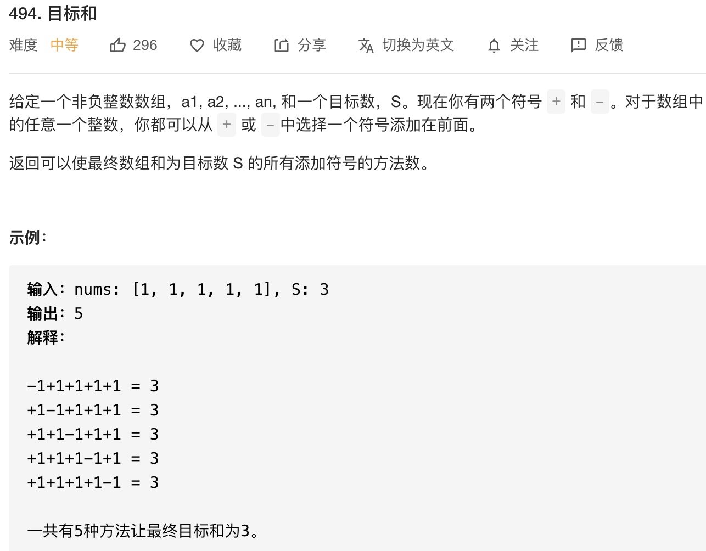

# 动态规划与回溯算法

```typescript
/*
leecode:
494.目标和（中等）
*/
```



注意，给出的例子 nums 全是 1，但实际上可以是任意正整数

## 一、回溯思路

任何算法的核心都是穷举，回溯算法那就是一个暴力穷举算法。回溯算法框架：

```typescript
function backtrack(路径，选择列表){
    if(满足结束条件){
        result.add(路径)
        return
    }

    for(选择 of 选择列表){
        做选择
        backtrack(路径，选择列表)
        撤销选择
    }
}
```

关键是搞清楚什么是【选择】，对于这道题，【选择】就是**对每个数字可以选择一个正号+或负号-**

```typescript
// 伪码思路

function backtrack(nums,i){
    if(i == nums.length){
        if(arrive to target){
            result +=1;
        }
        return
    }

    for (const item of [1,-1]) {
        选择 op - nums[i]
        // 穷举nums[i+1]的选择
        backtrack(nums,i+1)
        撤销选择
    }
}
```

```typescript
let result = 0;
function findTargetSumWays(nums: number[], target: number) {
  if (nums.length == 0) return 0;
  backtrack(nums, 0, target);
  return result;
}

// 回溯算法模板
function backtrack(nums, i, rest) {
  // base case
  if (i == nums.legnth) {
    if (rest == 0) {
      // 说明恰好凑出target
      result++;
    }
    return;
  }
  // 给nums[i]选择 - 号
  rest += nums[i];
  // 穷举nums[i+1]
  backtrack(nums, i + 1, rest);
  // 撤销选择
  rest -= nums[i];

  // 给nums[i]选择+号
  rest -= nums[i];
  //穷举nums[i+1]
  backtrack(nums, i + 1, rest);
  // 撤销选择
  rest += nums[i];
}
```

选择 - 的时候，为什么是 rest += nums[i]，选择 + 的时候，为什么是 rest -= nums[i] 呢。因为【如何凑出 target】和【如何把 target 减到 0】是一样的，上述代码选择的后者。

## 二、消除重叠子问题

动态规划之所以比暴力算法快，是因为动态规划技巧消除了重叠子问题。

**对于重叠子问题，只要我们能够找到一个重叠子问题，那一定还存在很多重叠子问题**。因此状态(i,rest)是可以用备忘录技巧进行优化的：

```typescript
function findTargetSumWays(nums: number[], target: number) {
  if (nums.length == 0) return 0;
  return dp(nums, 0, target);
}

const memo = new Map();

function dp(nums: number[], i: number, rest: number) {
  // base case
  if (i == nums.length) {
    if (rest == 0) return 1;
    return 0;
  }
  // 转成字符串key
  let key = i + "," + rest;
  // 避免重复计算
  if (memo.has(key)) {
    return memo.get(key);
  }
  // 穷举
  let result =
    dp(nums, i + 1, rest - nums[i]) + dp(nums, i + 1, rest + nums[i]);
  // 记入备忘录
  memo.set(key, result);
  return result;
}
```

## 三、动态规划

todo:是否有必要，待定
