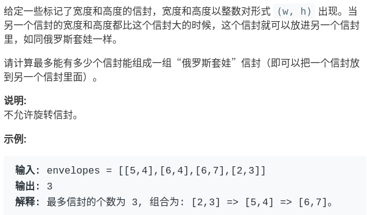

# 二维递增子序列

```typescript
/*
leecode:
354.俄罗斯套娃信封问题（困难）
*/
```

很多算法问题都需要排序技巧，其难点不在于排序本身，而是需要巧妙地排序进行预处理，将算法问题进行转换，为之后的操作打下基础。

信封嵌套问题就需要先按特定的规则排序，之后就转换为一个最长递增子序列 问题，可以用前文二分查找详解的技巧来解决。

## 题目概述



这道题目其实是最长递增子序列的一个变种，很显然，每次合法的嵌套是大的套小的，相当于找一个最长递增的子序列，其长度就是最多能嵌套的信封个数。

难点在于，标准的 LIS 算法只能在数组中寻找最长子序列，而我们的信封是由(w,h)这样的二维数对形成表示的，如何把 LIS 算法运用过来呢？

## 解法

**先对宽度 w 进行升序排序，如果遇到 w 相同的情况，则按照高度 h 降序排序。之后把所有的 h 作为一个数组，在这个数组上计算 LIS 的长度就是答案**。


然后在 h 上寻找最长递增子序列：


这个子序列就是最优的嵌套方案。

这个解法的关键在于：对于宽度 w 相同的数对，要对其高度 h 进行降序排序，因为两个宽度相同的信封不能互相包容的，逆序排序保证在 w 相同的数对中最多只选取一个。

```typescript
function maxEnvelopes(envelopes: number[][]) {
  let n = envelopes.length;
  // 按宽度升序排列，如果宽度一样，则按高度降序排列
  envelopes.sort((arrA, arrB) => {
    return arrA[0] == arrB[0] ? arrB[1] - arrA[1] : arrA[0] - arrB[0];
  });

  // 对高度数组寻找LIS
  let height = Array.from({ length: n }).map((i) => envelopes[i][1]);

  return lengthOfLIS(height);
}

function lengthOfLIS(nums: number[]) {
  let top = Array.from({ length: nums.length });
  // 牌堆数初始化为0
  let piles = 0;
  for (let i = 0; i < nums.length; i++) {
    // 要处理的扑克牌
    const poker = nums[i];

    // 搜索左侧边界的二分查找
    // 最终结果是要确定left的值
    let left = 0,
      right = piles;
    while (left < right) {
      let mid = Math.floor((left + right) / 2);
      if (top[mid] >= poker) {
        right = mid;
      } else {
        left = mid + 1;
      }
    }

    // 没找到合适的牌堆，新建一堆
    if (left == piles) {
      piles++;
      top[piles] = poker;
    } else {
      // 把这张牌放到牌堆顶
      top[left] = poker;
    }
  }

  // 牌堆数就是LIS长度
  return piles;
}
```

时间复杂度为 O(NlogN),因为排序和计算 LIS 各需要 O(NlogN)的时间，空间复杂度为 O(N),因为计算 LIS 的函数中需要一个 top 数组
