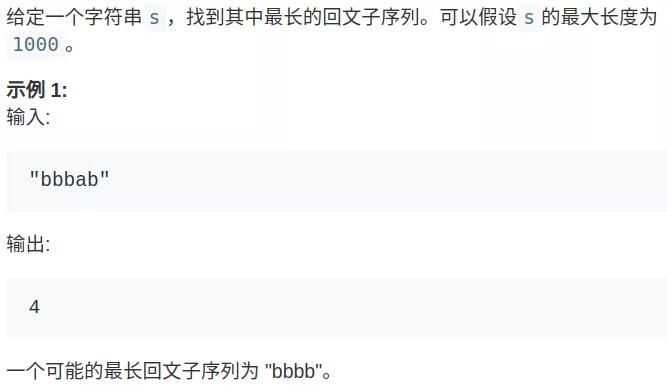

# 子序列问题模板-最长回文子序列

子序列模板一般就两种

## 两种思路

### 1.第一种思路模板是一个一维的 dp 数组

```typescript
let n = array.length;
const dp = Array.from({ length: n });

for (let i = 0; i < n; i++) {
  for (let j = 0; j < i; j++) {
    dp[i] = 最值(dp[i],dp[j]+...)
  }
}
```

在【最长递增子序列】中，dp 数组定义是：

**在子数组 array[0..i]中，以 array[i]结尾的目标子序列（最长递增子序列）的长度是 dp[i]**.

### 2.第二种思路模板是一个二维的 dp 数组

```typescript
let n = arr.length;
const dp = Array.from({ length: n }).map((i) => {
  return Array.from({ length: n }).map((j) => -1);
});

for (let i = 0; i < n; i++) {
  for (let j = 1; j < n; j++) {
    if ((arr[i] = arr[j])) {
      dp[i][j] = dp[i][j] + ...;
    } else {
      dp[i][j] = 最值(...)
    }
  }
}
```

这种思路运用相对多一些，尤其涉及两个字符串/数组的子序列,这个思路 dp 数组含义又分为[只涉及一个字符串]和[涉及两个字符串]的情况

- 1.涉及两个字符串/数组(比如最长公共子序列)，dp 数组含义如下：

**在子数组 arr1[0..i]和子数组 arr2[0..j]中，我们要求的子序列（最长公共子序列）长度为 dp[i][j]**。

- 2.只涉及一个字符串/数组(比如本文中的最长回文子序列)，dp 数组的含义如下：

**在子数组 array[i..j]中，我们要求的子序列（最长回文子序列）的长度为 dp[i][j]**。

## 最长回文子序列



定义 dp 数组：**在子串 s[i..j]中，最长回文子序列的长度为 dp[i][j]**。**找状态转移需要归纳思维，即如何从已知的结果推出未知的部分**。

如果我们想求 dp[i][j]，假设你知道了子问题 dp[i+1][j-1]的结果(s[i+1..j-1]中最长回文子序列的长度)，能否算出 dp[i][j]的值(s[i..j]中，最长回文子序列的长度)？

**这取决于 s[i]和 s[j]的字符：**：

- **如果他们相等**，那么它两加上 s[i+1..j-1]中的最长回文子序列就是 s[i..j]的最长回文子序列。

- **如果它两不相等**，说明它两**不可能同时**出现在 s[i..j]的最长回文子序列中，那么把它俩分别加入 s[i+1..j-1]中，看看那个子串产生的回文子序列更长即可。

```typescript
if (s[i] == s[j]) {
  // 它俩一定在最长回文子序列中
  dp[i][j] = dp[i + 1][j - 1] + 2;
} else {
  // s[i+1...j] 和 s[i..j-1]谁的回文子序列更长
  dp[i][j] = Math.max(dp[i + 1][j], dp[i][j - 1]);
}
```

## 代码实现

首先明确一下 basecase，如果只有一个字符，显然最长回文子序列长度是 1，即 dp[i][j]=1,(i==j).

因为 i 肯定小于等于 j，所以对于那些 i>j 的位置，根本不存在子序列，应该初始化为 0；

想求 dp[i][j]需要知道 dp[i+1][j-1],dp[i+1][j],dp[i][j-1]这三个位置,**只能斜着遍历或者反着遍历**

```typescript
function longestPalindromeSubseq(s: string) {
  let n = s.length;
  const dp = Array.from({ length: n }).map((i) => {
    return Array.from({ length: n }).map((j) => 0);
  });
  // base case
  for (let i = 0; i < n; i++) {
    dp[i][i] = 1;
  }
  // 反着遍历确保dp[i+1][j-1],dp[i+1][j],dp[i][j-1]这三个位置
  for (let i = n - 1; i >= 0; i--) {
    for (let j = i + 1; j < n; j++) {
      // 状态转移方程
      if (s[i] == s[j]) {
        dp[i][j] = dp[i + 1][j - 1] + 2;
      } else {
        dp[i][j] = Math.max(dp[i + 1][j], dp[i][j - 1]);
      }
    }
  }
  // 整个s的最长回文子串长度
  return dp[0][n - 1];
}
```
