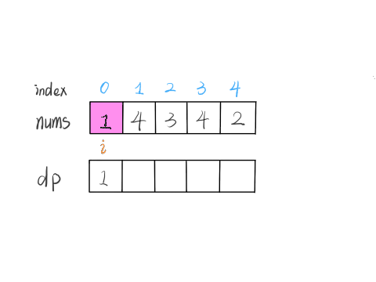

# 最长递增子序列

```typescript
/*
leecode:
300.最长上升子序列（中等）
*/
```

最长递增子序列(longest Increasing Subsequence,简称 LIS)，比较容易想到的是动态规划解法，时间复杂度 O(N^2),借由这题解析如何找到动态规划状态转移方程。比较难想到的是利用二分查找，时间复杂度是 O(NlogN).


【子序列】和【子串】这两个名词的区别，子串一定是连续的，而子序列不一定是连续的。

## 动态规划解法

动态规划的核心设计思想是数学归纳法。比如**我们先假设这个结论在 k<n 时成立，然后根据这个假设，想办法推导证明出 k=n 时也成立**。

类似的，设计动态规划算法，需要一个 dp 数组，可以假设 dp[0...i-1]都已经被算出来了，然后问自己：如何通过这些结果算出 dp[i].

对于最长递增子序列，**dp[i]表示以 nums[i]这个数结尾的最长递增子序列的长度**。

根据这个定义，我们可以推出 base case:dp[i]初始值为 1，因为以 nums[i]结尾的最长递增子序列起码要包含自己。



根据这个定义，我们的最终结果(子序列的最大长度)应该是 dp 数组中的最大值。

```typescript
let res = 0;
for (let i = 0; i < dp.length; i++) {
  res = Math.max(res, dp[i]);
}
return res;
```

**假设我们已经知道了 dp[0..4]的所有结果，我们如何通过这些结果推出 dp[5]**?

根据刚才我们对 dp 数组的定义，现在想求 dp[5]的值，也就是想求以 nums[5]为结尾的最长递增子序列。

**nums[5]=3,既然是递增子序列，我们只要找到前面那些结尾比 3 小的子序列，然后把 3 接到最后，就可以形成一个新的递增子序列，而且这个新的子序列长度加一**。

显然，可能形成很多种新的子序列，但是我们只选择最长的哪一个，把最长子序列的长度作为 dp[5]的值即可。


```typescript
for (let j = 0; j < i; j++) {
  if (nums[i] > nums[j]) {
    dp[i] = Math.max(dp[i], dp[j] + 1);
  }
}
```

当 i=5 时，这段代码的逻辑就可以算出 dp[5]，以此推算其他的：

```typescript
for (let i = 0; i < nums.length; i++) {
  for (let j = 0; j < i; j++) {
    if (nums[i] > nums[j]) {
      dp[i] = Math.max(dp[i], dp[j] + 1);
    }
  }
}
```

完整代码：

```typescript
function lengthOfLIS(nums: number[]) {
  // base case :dp 数组全部初始化为1
  let dp = Array.from({ length: nums.length }).map((i) => 1);
  for (let i = 0; i < nums.length; i++) {
    for (let j = 0; j < i; j++) {
      if (nums[i] > nums[j]) {
        dp[i] = Math.max(dp[i], dp[j] + 1);
      }
    }
  }

  return Math.max(...dp);
}
```

时间复杂度 O(N^2),总结一下如何找到动态规划的状态转移关系：

- 1.明确 dp 数组所存数据的含义，这一步对于任何动态规划问题都很重要，如果不得当或者不够清晰，会阻碍之后的步骤。

- 2.根据 dp 数组的定义，运用数学归纳法的思想，假设 dp[0..i-1]都已知，想办法求出 dp[i]，一旦这一步完成，这个题基本就解决了。

但如果无法完成这一步，很可能就是 dp 数组的定义不够恰当，需要重新定义 dp 数组的含义，或者可能是 dp 数组存储的信息还不够，不足以推出下一步答案，需要把 dp 数组扩大成二维数组甚至三维数组。

## 二分查找

一堆扑克牌遵循以下规则：

只能把点数小的牌压到点数比它大的牌上；如果当前牌点数较大没有可以放置的堆，则新建一个堆，把这张牌放进去，如果当前牌有多个堆可供选择，则选择最左边的那一堆放置。


为什么遇到多个可选择堆的时候要放到最左边的堆上呢？这样可以保证牌堆顶的牌有序（2，4，7，8，Q），证明略。


按照上述规则执行，可以算出最长递增子序列，牌的堆数就是最长递增子序列的长度，证明略。


每次处理一张扑克牌即要找一个合适的牌堆顶，牌堆顶的牌是有序的，这就能用到二分查找：用二分查找来搜索当前牌应放置的位置

```typescript
function lengthOfLIS(nums: number[]) {
  let top = Array.from({ length: nums.length });
  // 牌堆数初始化为0
  let piles = 0;
  for (let i = 0; i < nums.length; i++) {
    // 要处理的扑克牌
    const poker = nums[i];

    // 搜索左侧边界的二分查找
    // 最终结果是要确定left的值
    let left = 0,
      right = piles;
    while (left < right) {
      let mid = Math.floor((left + right) / 2);
      if (top[mid] > poker) {
        right = mid;
      } else if (top[mid] < poker) {
        left = mid + 1;
      } else {
        right = mid;
      }
    }

    // 没找到合适的牌堆，新建一堆
    if (left == piles) {
      piles++;
      top[piles] = poker;
    } else {
      // 把这张牌放到牌堆顶
      top[left] = poker;
    }
  }

  // 牌堆数就是LIS长度
  return piles;
}
```
