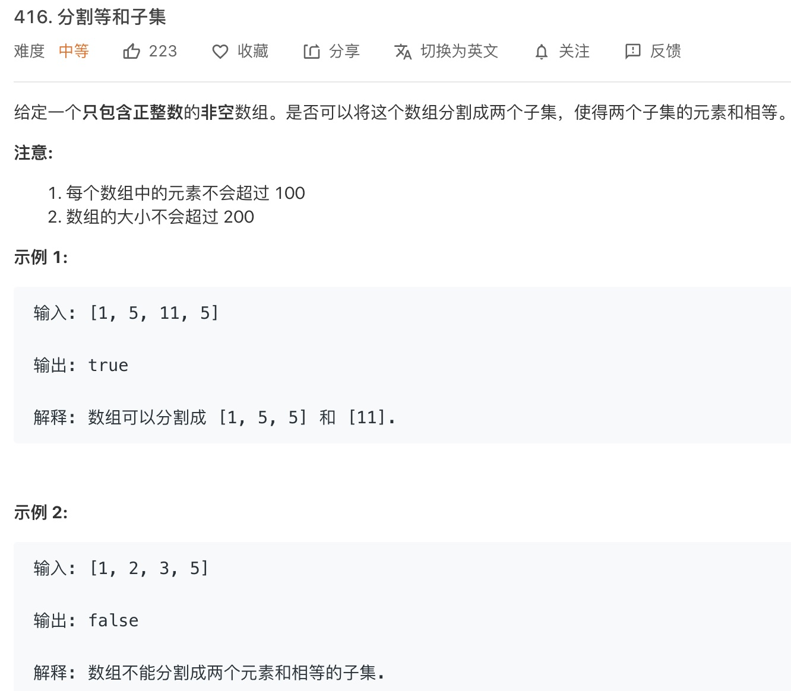

# 子集背包问题

```typescript
/*
leecode:
416.分割等和子集（中等）
*/
```



对于这个问题，我们可以先对集合求和，得出 sum，把问题转化为背包问题：

**给一个可装载重量为 sum/2 的背包和 N 个物品，每个物品的重量为 nums[i]。现在让你装物品，是否存在一种装法，能够恰好将背包装满**？

## 解法分析

### 第一步：明确【状态】和【选择】

状态就是【背包的容量】和【可选择的物品】，选择就是【装进背包】或者【不装进背包】

### 第二步：明确 dp 数组

dp[i][j]=x 表示，对于前 i 个物品，当前背包的容量为 j 时，若 x 为 true，则说明可以恰好将背包装满，若 x 为 false，则说明不能恰好将背包装满。

根据这个定义，我们想求的最终答案就是 dp[N][sum/2],base case 就是 dp[..][0]=true 和 dp[0][..]=false，因为背包没有空间的时候，就相当于装满了，而当没有物品可选择的时候，肯定没办法装满背包

### 第三步：根据【选择】，思考状态转移的逻辑

根据【选择】对 dp[i][j]得到以下状态转移：

如果不把 nums[i]算入子集，**或者说你不把这第 i 个物品装入背包**，那么能否恰好装满背包，取决于上一个状态 dp[i-1][j],继承之前的结果。

如果把 nums[i]算入子集，**或者说你把这第 i 个物品装入背包**，那么是否能够装满背包，取决于 dp[i-1]j-nums[i-1]].

首先，由于 i 是从 1 开始的，而数组索引是从 0 开始的，所以第 i 个物品的重量应该是 nums[i-1].

dp[i-1]j-nums[i-1]]:你如果装了第 i 个物品，就要看背包的剩余重量 j-nums[i-1]限制下是否能够被恰好装满。换句话说，如果 j-nums[i-1]的重量可以被恰好装满，那么只要把第 i 个物品装进去，也可恰好装满 j 的重量；否则的话，重量 j 肯定是装不满的。

```typescript
function canParittion(nums: number[]) {
  let sum = nums.redux((r, item) => r + item);
  // 和为奇数时，不能划分成两个和相等的集合
  if (sum % 2 != 0) return false;
  let n = nums.length;
  sum = sum / 2;
  const dp = Array.from({ length: n + 1 }).map((i) => {
    return Array.from({ length: sum + 1 }).map((j) => false);
  });
  // base case
  for (let i = 0; i <= n; i++) {
    dp[i][0] = true;
  }

  for (let i = 1; i <= n; i++) {
    for (let j = 1; j <= sum; j++) {
      if (j - nums[i - 1] < 0) {
        // 背包容量不足，不能装入第i个物品
        dp[i][j] = dp[i - 1][j];
      } else {
        // 装入或不装入背包
        dp[i][j] = dp[i - 1][j] || dp[i - 1][j - nums[i - 1]];
      }
    }
  }
  return dp[n][sum];
}
```

## 状态压缩

**注意到 dp[i][j]都是通过上一行 dp[i-1][..]转移过来的**，之后的数据都不会再使用了。所以可以进行状态压缩，将二维数组 dp 数组压缩为一维

```typescript
function canPartition(nums: number[]) {
  let sum = nums.reduce((r, item) => r + item);
  // 和为奇数时，不能划分成两个和相等的集合
  if (sum % 2 != 0) return false;
  sum = sum / 2;
  const dp = Array.from({ length: sum + 1 }).map((i) => false);
  dp[0] = true;

  for (let i = 0; i < nums.length; i++) {
    for (let j = sum; j >= 0; j--) {
      if (j - nums[i] >= 0) {
        // 核心为dp[0]=true
        //如果 j-nums[i]的重量可以被恰好装满
        dp[j] = dp[j] || dp[j - nums[i]];
      }
    }
  }
  return dp[sum];
}
```

这段代码和之前的解法思路完全相同，只在一行 dp 数组上操作，i 每进行一轮迭代，dp[j] 其实就相当于 dp[i-1][j]，所以只需要一维数组就够用了。
