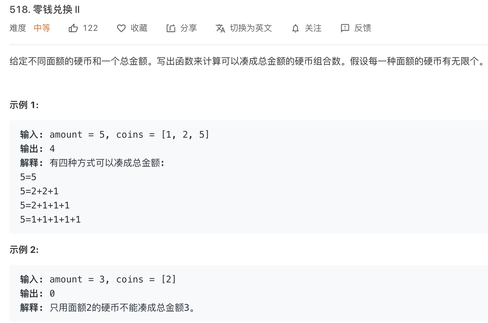

# 完全背包问题

```typescript
/*
leecode:
518.零钱兑换II（中等）
*/
```



将题目转化为背包问题的描述形式：

有一个背包，最大容量为 amount，有一系列物品 coins，每个物品的重量为 coins[i],每个物品的数量无限，请问有多少种方法，能够把背包恰好装满？

## 解题思路

### 第一步明确【状态】【选择】

状态有两个，【背包的容量】和【可选择的物品】，选择就是【装进背包】或【不装进背包】

```typescript
for 状态1 of 状态1的所有取值：
    for 状态2 of 状态2的所有取值：
        for ...
            dp[状态1][状态2][...] = 计算(选择1，选择2...)
```

## 第二步 定义 dp 数组

刚才找到的状态有两个，所以需要一个二维 dp 数组：

dp[i][j]:若只使用前 i 个物品，当背包容量为 j 时，有 dp[i][j]种方法可以装满背包。

翻译过来就是：**若只使用 coins 中的前 i 个硬币的面值，若想凑出金额 j，有 dp[i][j]中凑发**。

base case 为 dp[0][..]=0,dp[..][0]=1.因为如果不使用任何硬币面值，就无法凑出任何金额；如果凑出的目标金额为 0，就无效。

```typescript
dp[N+1][amount+1]
dp[0][..]=0
dp[..][0]=1

for i of [1..N]:
    for j of [1..amount]:
        把物品i装进背包，
        不把物品i装进背包
return dp[N][amount]
```

## 第三步，根据【选择】，确定状态转移的逻辑

注意，这个问题的特殊点在于物品的数量是无限的

**如果你不把这第 i 个物品装入背包**，也就是说你不使用 coins[i]这个面值的硬币，那么凑出面额 j 的方法数 dp[i][j]应该等于 dp[i-1][j],继承前面的结果

**如果你把第 i 个物品装入背包**，也就是说你使用 coins[i]这个面值的硬币，那么 dp[i][j]应该等于 dp[i]j-coins[i-1]]

首先由于 i 是从 1 开始的，所以 coins 的索引是 i-1 时表示第 i 个硬币的面值。

dp[i]j-coins[i-1]]，如果你决定使用这个面值的硬币，那么就应该关注如何凑出金额 j-coins[i-1].

比如，你想用面值为 2 的硬币凑出金额 5，那么如果你知道了凑出金额 3 的方法，再加上一枚面额为 2 的硬币，就可以凑出 5 了。

**综上就是两种选择，而我们想求的 dp[i][j]是[共有多少种凑法]，所以 dp[i][j]的值应该是以上两种选择的结果之和**：

```typescript
for (let i = 1; i <= n; i++) {
  for (let j = 1; j <= amount; j++) {
    if (j - coins[i - 1] >= 0) {
      dp[i][j] = dp[i - 1][j] + dp[i][j - coins[i - 1]];
    }
  }
}
return dp[N][W];
```

```typescript
function change(amount: number, coins: number[]) {
  let n = coins.length;
  const dp = Array.from({ length: n + 1 }).map((i) => {
    return Array.from({ length: amount + 1 });
  });

  for (let i = 0; i <= n; i++) {
    dp[i][0] = 1;
  }

  for (let i = 1; i <= n; i++) {
    for (let j = 1; j <= amount; j++) {
      if (j - coins[i - 1] >= 0) {
        dp[i][j] = dp[i - 1][j] + dp[i][j - coins[i - 1]];
      } else {
        dp[i][j] = dp[i - 1][j];
      }
    }
  }

  return dp[n][amount];
}
```

dp 数组的转移只和 dp[i][...]和 dp[i-1][...]有关，所以可以压缩状态，进一步降低算法 空间复杂度

```typescript
function change(amount: number, coins: number[]) {
  let n = coins.length;
  const dp = Array.from({ length: amount + 1 });
  dp[0] = 1;

  for (let i = 0; i < n; i++) {
    for (let j = 1; j <= amount; j++) {
      if (j - coins[i] >= 0) {
        dp[j] = dp[j] + dp[j - coins[i]];
      }
    }
  }
  return dp[amount];
}
```
