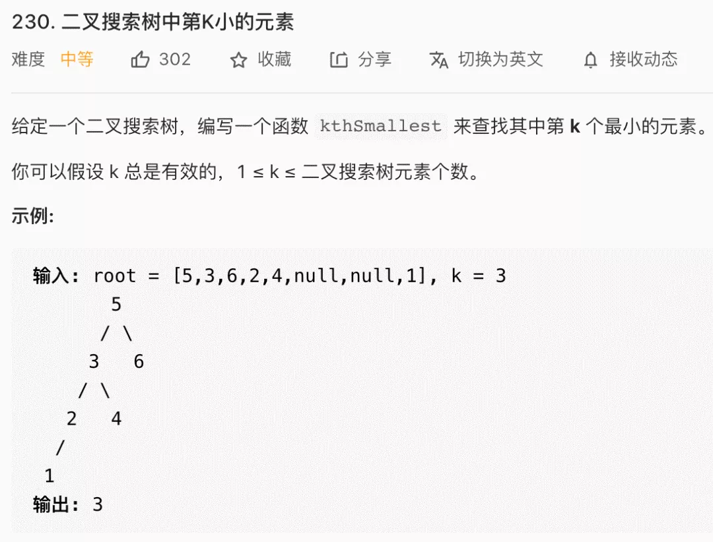
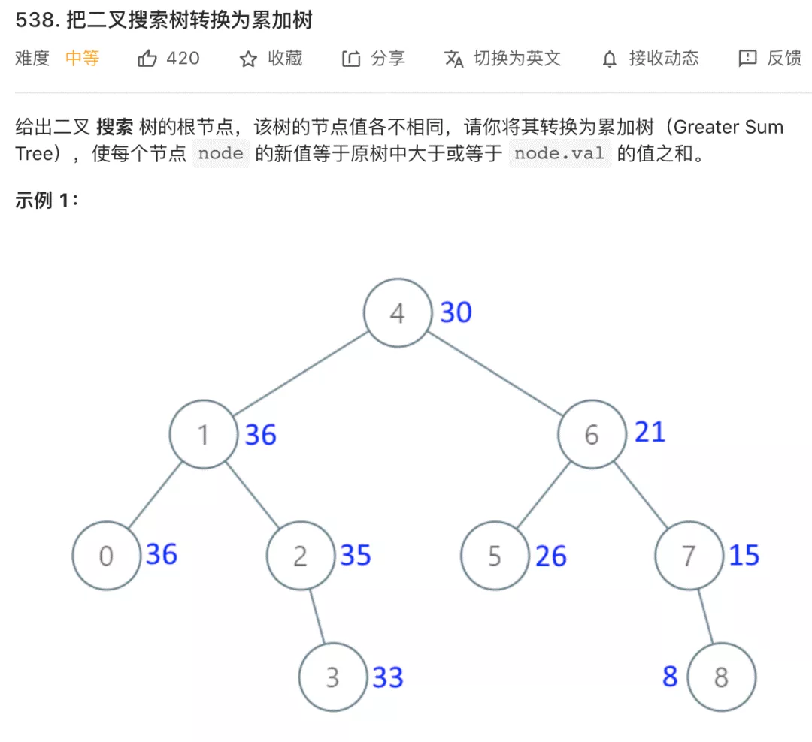
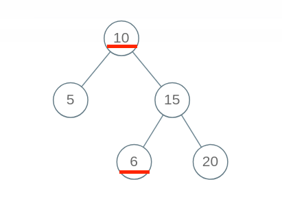
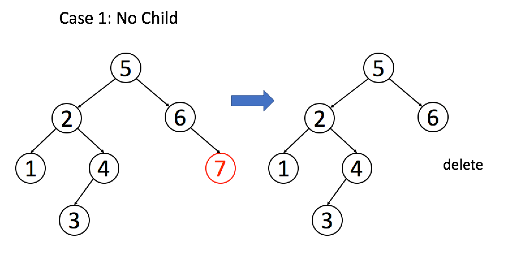
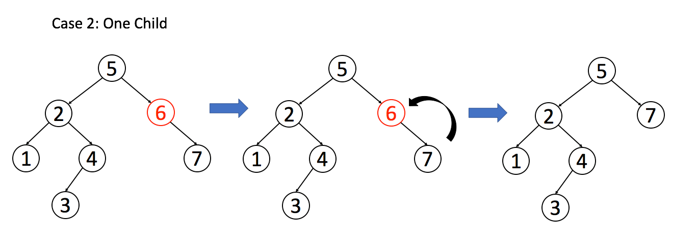

# 二叉树搜索

```typescript
/*
leecode:
230.BST第K小的元素（中等）
538.二叉搜索树转化累加树（中等）
1038.BST转累加树（中等）

450.删除二叉搜索树中的节点（中等）
701.二叉搜索树中的插入操作（中等）
700.二叉搜索树中的搜索（简单）
98.验证二叉搜索树（中等）

96.不同的二叉搜索树（Easy）
95.不同的二叉搜索树II（Medium）
*/
```

## BTS 的特性

- 1.对于 BST 的每一个节点 node，左子树节点的值都比 node 的值要小，右子树节点的值都比 node 的值大

- 2.对于 BST 的每一个节点 node，它的左侧子树和右侧子树都是 BST。

二叉树结构不算复杂，但是基于 BST 的数据结构有 AVL，红黑树等，拥有了自平衡性质，可以提供 logN 级别的增删改查效率；还有 B+树，线段树等结构都是基于 BST 的思想来设计的。

**BST 除了它的定义，还有一个重要的性质：BST 的中序遍历结构是有序的（升序）**。

### 寻找第 K 小的元素



按照 BST 的中序遍历就是升序排序的结果：

```typescript
function kthSmallest(root: TreeNode, k: number) {
  traverse(root, k);
  return res;
}

let res = 0;
let rank = 0;
function traverse(root: TreeNode, k: number) {
  if (root == null) return;

  traverse(root.left, k);

  // 中序遍历代码位置
  rank++;

  if (k == rank) {
    // 找到第k小的元素
    res = root.val;
    return;
  }

  traverse(root.right, k);
}
```

**因为这个解法并不是最高效的解法，而是仅仅适用于这道题**。其最坏时间复杂度是 O(N),N 是 BST 的节点个数。而红黑树这种自平衡 BST，增删改查都是 O(logN),所以计算第 k 个小元素，最好的算法肯定也是对数级别的复杂度，不过这个依赖于 BST 节点记录的信息有多少。

BST 能够在对数时间找到该元素的根本原因还是在 BST 的定义里，左子树小，右子树大。所有每个节点都可以通过对比自身的值判断去左子树还是右子树搜索目标值，从而避免全树遍历。达到对数级复杂度。

回到当前问题，想找到第 k 小的元素，如果想达到对数级复杂度，关键在于每个节点知道自己排第几。比如需要查找排名为 k 的元素，当前节点知道自己排名第 m，那么我可以比较 m 和 k 的大小：

- 1.如果 m==k,显然就是找到了第 k 个元素，返回当前节点即可

- 2.如果 k < m,可以去左子树搜索第 k 个元素

- 3.如果 k > m，即去右子树搜索 k-m-1 个元素

要知道每个节点自己的排名，**每个节点需要记录，以自己为根的这颗二叉树有多少个节点**。

即，TreeNode 中的字段应该如下：

```typescript
class TreeNode {
  val: number;
  // 以该节点为根的树的节点总数
  size: number;
  left: TreeNode;
  right: TreeNode;
}
```

有了 size 字段，外加 BST 节点左小右大的性质，对于每个节点 node 就可以通过 node.left 推导出 node 的排名，从而做到我们刚才说到的对数级算法。当然 size 字段需要在增删元素的时候被正确维护

### BST 转化累加树



比如图中的节点 5，转化成累加树，比 5 大的节点有 6，7，8，加上 5 本身，所以累加树上的这个节点的值应该是 5+6+7+8=26.

按照二叉树的通用思路，需要思考每个节点应该做什么，但是这道题上很难想到什么思路。

BSTd 的每个节点左小右大，似乎是个有用的信息，既然累加和计算大于等于当前值的所有元素之和，那么每个节点都去计算右子树的和，不就行了？

这是不行的，对于一个节点来说，确实右子树都是比它大的元素，但问题是它的父节点也可能是比它大的元素。这个是没办法确定的，所以二叉树的通用思路在这里是用不了的。

**正确的解法，还是利用 BST 的中序遍历特性**。

降序打印节点的值：

```typescript
function traverse(root: TreeNode) {
  if (root == null) return;
  traverse(root.right);
  print(root.val);
  traverse(root.left);
}
```

**这段代码从大到小降序打印 BST 节点的值，如果维护一个外部累加变量 sum，然后把 sum 赋值给 BST 中的每个节点，不就讲 BST 转化成累加树了吗？**

```typescript
function convertBST(root: TreeNode) {
  traverse(root);
  return root;
}

let sum = 0;
function traverse(root: TreeNode) {
  if (root == null) return;

  traverse(root.right);
  // 维护累加和
  sum += root.val;
  //将BST转化成累加树
  root.val = sum;
  traverse(root.left);
}
```

## BST 的基本操作

判断 BST 的合法性、增、删、查

### 判断 BST 的合法性

按照刚才的思路，每个节点自己要做的事就是比较自己和左右子节点，看起来应该这样写代码：

```typescript
function isValidBST(root: TreeNode) {
  if (root == null) return true;
  if (root.left != null && root.val <= root.left.val) return false;
  if (root.right !== null && root.val >= root.right.val) return false;

  return isValidBST(root.left) && isValidBST(root.right);
}
```

但是这个算法出现了错误，BST 的每个节点应该要小于右边子树的所有节点，下面的二叉树显然不是 BST，因为节点 10 的右子树中有一个节点 6，但我们的算法会把它判定为合法 BST：



**问题的原因是：对于每一个节点 root，代码值检查了它的左右子节点是否符合左小右大的原则；但是根据 BST 的定义，root 的整个左子树都要小于 root.val，整个右子树都要大于 root.val**。

问题是，对于某一个节点 root，它如何把 root 的约束传递给左右子树呢。

```typescript
function isValid(root: TreeNode) {
  return isValidBST(root, null, null);
}

// 限定以root为根的子树节点必须满足max.val > root.val > min.val
function isValidBST(root: TreeNode, min: TreeNode, max: TreeNode) {
  // base case
  if (root == null) return true;
  // 若root.val不合符max和min的限制，说明不是合法BST
  if (root.left != null && root.val <= min.val) return false;
  if (root.right !== null && root.val >= max.val) return false;

  return isValidBST(root.left, min, root) && isValidBST(root.right, root, max);
}
```

**通过使用辅助函数，增加函数参数列表，在参数中携带额外信息，将这种约束传递给子树的所有节点，这也是二叉树算法的一个小技巧**。

### 在 BST 中搜索一个数

```typescript
function isInBST(root: TreeNode, target: number) {
  if (root == null) return false;
  if (root.val == target) return true;
  if (root.val < target) return isInBST(root.right, target);
  if (root.val > target) return isInBST(root.left, target);
}
```

对原始框架进行改造，抽象出一套**针对 BST 的遍历框架**：

```typescript
function BST(root: TreeNode, target: number) {
  if (root.val == target) {
    // do something
  }
  if (root.val < target) {
    BST(root.right, target);
  }
  if (root.val > target) {
    BST(root.left, target);
  }
}
```

### 在 BST 中插入一个数

对数据结构的操作无非遍历+访问，遍历就是【找】，访问就是【改】，具体到问题，插入一个数，就是先找到插入位置，然后进行插入操作。

上一个问题，总结了 BST 中的遍历框架，就是【找】的问题，直接套框架，加上【改】的操作即可，**一旦涉及【改】，函数就要返回 TreeNode 类型，并且对递归调用的返回值进行过接收**。

```typescript
function insertIntoBST(root: TreeNode, val: number) {
  // 找到空位置插入新节点
  if (root == null) return newTreeNode(val);

  //if(root.val == val){
  //BST中一般不会插入已存在的元素
  //}

  if (root.val < val) {
    root.right = insertInToBST(root.right, val);
  }
  if (root.val > val) {
    root.left = insertInToBST(root.left, val);
  }
}
```

### 在 BST 中删除一个数

先写框架：

```typescript
function deleteNode(root: TreeNode, key: number) {
  if (root.val == key) {
    // 找到了，进行删除
  } else if (root.val > key) {
    // 去左子树找
    root.left = deleteNode(root.left, key);
  } else if (root.val < key) {
    // 去右子树找
    root.right = deleteNode(root.right, key);
  }
  return root;
}
```

删除指定节点，是难点，因为删除节点的同时不能破坏 BST 的性质。有三种情况：

- 情况 1:目标节点恰好是末端节点，两个子节点都为空，可直接删除



```typescript
if (root.left == null && root.right == null) return null;
```

- 情况 2:目标节点只有一个非空子节点，那么需要让子节点接替它的位置



```typescript
// 排除了情况1之后
if (root.left == null) return root.right;
if (root.right == null) return root.left;
```

- 情况 3:目标节点有两个子节点，为了不破坏 BST 的性质，A 必须找到左子树中最大的按个节点，或者右子树中最小的那个节点来替代自己


```typescript
if (root.left != null && root.right != null) {
  // 找到右子树的最小节点
  let minNode = getMin(root.right);
  // 把root改成minNode
  root.val = minNode.val;
  // 转而去删除minNode
  root.right = deleteNode(root.right, minNode.val);
}
```

三种情况分析完毕，填入框架，简化代码：

```typescript
function deleteNode(root: TreeNode, key: number) {
  if (root == null) return null;
  if (root.val == key) {
    // 把情况1和2都处理了
    if (root.left == null) return root.right;
    if (root.right == null) return root.left;
    // 处理情况3
    let minNode = getMin(root.right);
    root.val = minNode.val;
    root.right = deleteNode(root.right, minNode.val);
  } else if (root.val > key) {
    root.left = deleteNode(root.left, key);
  } else if (root.val < key) {
    root.right = deleteNode(root.right, key);
  }
  return root;
}

function getMin(node: TreeNode) {
  // BST最左边的就是最小的
  while (node.left != null) {
    node = node.left;
  }
  return node;
}
```

删除操作完成了，但是这个删除操纵并不完美，我们一般不会通过 root.val=minNode.val 修改节点内部的值来交换节点，而是通过一些列略微复杂的链表操作交换 root 和 minNode 两个节点。

因为具体应用中，val 域可能会使一个复杂的数据结构，修改起来非常麻烦；而链表操作无非改一下指针，而不会去碰内部数据。

这里我们暂时忽略这个细节，旨在突出 BST 基本操作的共性，以及借助框架逐层细化问题的思维方式。

## 计算所有合法 BST

### 不同的二叉搜索树

给你一个正整数 n，计算存储{1,2,3...n}这些值共有多少种不同的 BST 结构。

比如输入 n=3，算法返回 5，因为共有如下 5 中不同的 BST 结构存储{1,2,3}：


这是一个穷举问题。**二叉树算法的关键在于明确根节点需要做什么，BST 作为一种特殊的二叉树，核心思路是一样**。

比如 n=5 时，这个 BST 根节点共有多少种情况？{1,2,3,4,5},每个数字都可作为根节点。比如固定 3 作为根节点，根据 BST 的特性，根节点的左子树都比根节点的值小，右子树的值都比根节点的值大。

所以固定 3 作为根节点，左子树就是{1,2}的组合，右子树就是{4,5}。

**左子树的组合数和右子树的组合数乘积**就是 3 作为根节点的 BST 个数

如何通过计算表达上述左右子节点的规则：

```typescript
// 定义：闭区间[lo,hi]的数字能组成count(lo,hi)种BST
function count(lo: number, hi: number);
```

根据上述函数定义，结合上述分析，可以得出代码：

```typescript
function numTree(n: number) {
  return count(1, n);
}

// 计算闭区间[lo,hi]组成的BST的个数
function count(lo: number, hi: number) {
  // base case
  if (lo > hi) return 1;

  let res = 0;
  for (let i = lo; i <= hi; i++) {
    // i的值作为根节点root
    let left = count(lo, i - 1);
    let right = count(i + 1, hi);
    // 左右子树的组合数乘积是BST的总数
    res += left * right;
  }

  return res;
}
```

注意 vase case，显然当 lo>hi 闭区间[lo,hi]肯定是个空区间，也就对于着空节点 null，虽然是空节点，但也是一种情况，所以要返回 1 而非 0；

题目要求已完成，但是时间复杂度非常高，存在重叠子问题，通过备忘录消除

```typescript
// 备忘录
let memo: number[][];

function numTrees(n: number) {
  memo = Array.from({ length: n + 1 }).map((i) => {
    Array.from({ length: n + 1 }).map((j) => 0);
  });

  return count(1, n);
}

function count(lo: number, hi: number) {
  if (lo > hi) return 1;
  if (memo[lo][hi] != 0) {
    return memo[lo][hi];
  }

  let res = 0;
  for (let mid = lo; mid <= hi; mid++) {
    let left = count(lo, mid - 1);
    let right = count(mid + 1, hi);
    res += left * right;
  }

  memo[lo][hi] = res;
  return res;
}
```

### 构建出所有合法 BST

```typescript
function generateTrees(n: number): TreeNode[] {}
```

与上道题思路一样：

- 1.穷举 root 节点的所有可能

- 2.递归构造出左右子树的所有合法 BST

- 3.给 root 节点穷举所有左右子树的组合

```typescript
function generateTrees(n: number): TreeNode[] {
  if (n == 0) return [];
  return build(1, n);
}

// 构造闭区间[lo,hi]组成的BST
function build(lo: number, hi: number): TreeNode[] {
  let res = [];

  // base case
  if (lo > hi) {
    res.push(null);
    return res;
  }

  // 1.穷举root节点所有可能
  for (let i = lo; i <= hi; i++) {
    // 2.递归构造出左右子树的所有合法BST
    let leftTree = build(lo, i - 1);
    let rightTree = build(i + 1, hi);
    // 3.给root节点穷举所有左右子树的组合
    for (const left of leftTree) {
      for (const right of rightTree) {
        // i 作为根节点root的值
        let root = new TreeNode(i);
        root.left = left;
        root.right = right;
        res.add(root);
      }
    }
  }
  return res;
}
```
