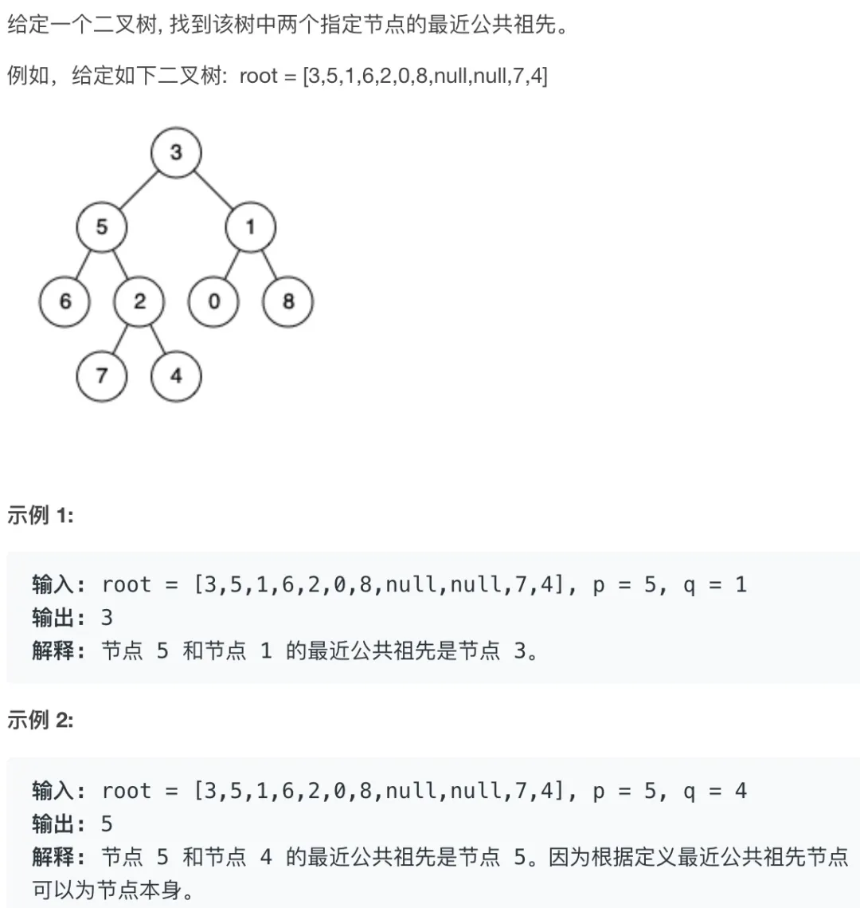

# 二叉树最近公共父节点

```typescript
/*
leecode:
236.二叉树的最近公共祖先（中等）
*/
```



函数签名：

```typescript
function lowestCommonAncestor(
  root: TreeNode,
  p: TreeNode,
  q: TreeNode,
): TreeNode {}
```

root 节点确定一棵二叉树，p 和 q 是这颗二叉树上的两个节点，让你返回 p 节点和 q 节点的最近公共父节点。

先写框架：

```typescript
function lowestCommonAncestor(
  root: TreeNode,
  p: TreeNode,
  q: TreeNode,
): TreeNode {
  let left = lowestCommonAncestor(root.left, p, q);
  let right = lowestCommonAncestor(root.right, p, q);
}
```

任何递归类型的问题，无非就是三点：

- 1.这个函数时干嘛的

- 2.这个函数参数中的变量是什么

- 3.得到函数的递归结果，你应该干什么

即 定义 状态 选择

## 解题思路

函数输入三个参数：root,p,q，它返回一个节点

- 情况 1，如果 p 和 q 都在以 root 为根的树中，函数返回的即是 p 和 q 的最近公共父节点

- 情况 2，如果 p 和 q 都不在以 root 为根的树中，函数返回 null

- 情况 3，如果 p 和 q 只有一个存在于 root 为根的树中，函数就会返回那个节点，作为下一次递归的参照

第二个问题，函数的参数中，变量是什么。

很明显是 root，每次递归就是把 root 转移成 root 的子节点，不断缩小问题规模

第三个问题，得到函数的递归结果，该干嘛？或者说做什么选择？

```typescript
function lowestCommonAncestor(
  root: TreeNode,
  p: TreeNode,
  q: TreeNode,
): TreeNode {
  // base case
  if (root == null) return null;
  if (root == p || root == q) return root;

  let left = lowestCommonAncestor(root.left, p, q);
  let right = lowestCommonAncestor(root.right, p, q);

  // 情况 1
  if (left != null && right != null) return root;
  // 情况2
  if (left == null && right == null) return null;
  // 情况3
  return left == null ? right : left;
}
```

对于情况 1，left 和 right 非空，分别是 p 和 q，可以说明 root 是他们的公共祖先，但能确定 root 就是**最近**公共祖先吗？

这是一个巧妙的地方，**因为这里是二叉树的后序遍历**，前序遍历可以理解为从上往下，后序遍历时从下向上，就好比从 p 和 q 出发向上走，第一次相交的节点就是 root。
