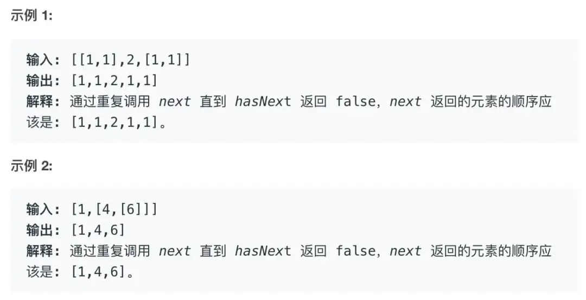

# 迭代器

```typescript
/*
leecode:
341.扁平化嵌套列表迭代器（中等）
*/
```



**迭代器也是设计模式的一种，目的就是为调用者屏蔽底层数据结构的细节，简单地通过 hasNext 和 next 方法有序地进行遍历**。

例如印象笔记中的**万物皆 block**，block 就是一种数据结构，比如标题、页面、表格都是 block。有的 block 甚至可以无限嵌套，打破了传统笔记本 文件夹 - 笔记本 - 笔记的三层结构

## 解题思路

NestedInteger 这个神奇的数据结构是问题的关键，我们不应该去尝试实现 NestedInteger 这个结构，也不应该去猜测它的实现

```typescript
class NestedInteger {
  private val: number;
  private list: NestedInteger[];

  public NestedInteger(val: number) {
    this.val = val;
    this.list = null;
  }
  public NestedInteger(list: NestedInteger[]) {
    this.list = list;
    this.val = null;
  }

  // 如果其中存的是一个整数，则返回 true，否则返回 false
  public isInteger() {
    return val != null;
  }

  // 如果其中存的是一个整数，则返回这个整数，否则返回 null
  public getInteger() {
    return this.val;
  }

  // 如果其中存的是一个列表，则返回这个列表，否则返回 null
  public getList() {
    return this.list;
  }
}
```

对比结构会发现：

```typescript
class NestedInteger {
  val: number;
  list: NestedInteger[];
}

// 基本的N叉树节点
class TreeNode {
  val: number;
  children: TreeNode[];
}
```

**NestedIntegrt 就是棵 N 叉树，叶子节点是 Number 类型，其 val 字段非空；其他节点都是 List<NestedInteger>类型，其 val 字段为空，但是 list 字段非空，装着子节点**。

因此**NestedInteger 扁平化就等价于遍历一颗 N 叉树的所有子节点**。

N 叉树遍历框架:

```typescript
function traverse(root: TreeNode) {
  for (const child of root.children) {
    traverse(child);
  }
}
```

我们只想要叶子节点，所以 traverse 函数只要再到达叶子节点的时候把 val 加入结果列表即可：

```typescript
class NestedInterator {
  private it;

  public NestedIterator(nestedList: number[]) {
    // 存放nestedList铺平的结果
    let result = [];
    for (const node of nestedList) {
      // 以每个节点为根遍历
      traverse(node, result);
    }
    // 得到result列表的迭代器
    this.it = result.iterator();
  }

  public next() {
    return it.next();
  }

  public hasNext() {
    return it.hasNext();
  }

  // 遍历以root为根的多叉树，将叶子节点的值加入result列表
  private traverse(root, result: number[]) {
    if (root.isInteger()) {
      // 到达叶子节点
      result.push(root.getInteger());
      return;
    }

    // 遍历框架
    for (const child of root.getList()) {
      traverse(child, result);
    }
  }
}
```
