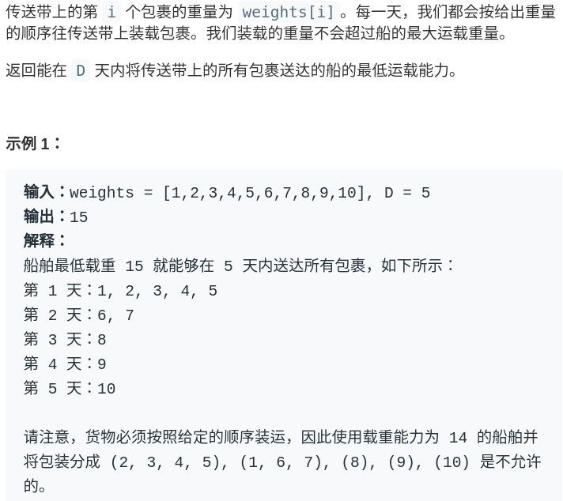

# 二分查找

抛开有序数组这个枯燥的数据结构，二分查找如何运用到实际的算法问题中呢？当搜索空间有序的时候，就可以通过二分搜索【剪枝】，大幅提升效率。

```typescript
/*
leecode:
875.爱吃香蕉的珂珂（中等）
1011.在D天内送达包裹的能力（中等）
*/
```


koko 每小时最多吃一堆香蕉，不管吃不吃得完，都下一次吃。

先看如何暴力解法：

首先 把 H 小时内吃完香蕉的最小速度设为 speed，显然最少为 1，最大为 max(piles),只要从 1 穷举到 max(piles)，一旦发现某个值可以在 H 小时内吃完所有香蕉，这个值就是最小速度：

```typescript
function minEatingSpeed(piles: number[], H: number) {
  let max = Math.max(...piles);
  for (let s = 1; s < max; s++) {
    if (canFinish(piles, speed, H)) return speed;
  }
  return maxf;
}
```

这个 for 循环，就是在**连续的空间线性搜索，这就是二分查找可以发挥作用的标志**。由于我们要求的是最小速度，所以可以用一个**搜索左侧边界的二分查找**来代替线性搜索，提升效率：

```typescript
function minEatingSpeed(piles: number[], H: number) {
  // 套用搜索左侧边界的算法框架
  let left = 1,
    right = Math.math(...piles) + 1;
  while (left < right) {
    // 防止溢出
    let min = left + Maht.floor((right - left) / 2);
    if (canFinish(piles, mid, H)) {
      right = mid;
    } else {
      left = mid + 1;
    }
  }
  return left;
}

function canFinish(piles: number, speed: number, h: number) {
  let time = 0;
  for (const n of piles) {
    time += timeOf(n, speed);
  }
  return time <= h;
}

function timeOf(n: number, speed: number) {
  return Math.ceil(n / speed);
}
```

算法时间复杂度为 O(NlogN)

## 扩展延伸



本质和 koko 吃香蕉一样的问题，首先确定 cap 的最小值和最大值分别为 max(weights)和 sum(weights).要求**最小载重**，可以用搜索左侧边界的二分查找算法优化线性搜索

```typescript
// 寻找左侧边界的二分查找
function shipWithinDays(weights: number[], D: number) {
  // 载重可能的最小值
  let left = Math.max(...weights);
  // 载重的可能的最大值+1
  let right = weights.reduce((res, cur) => res + cur, 0) + 1;
  while (left < right) {
    let mid = left + Maht.floor((right - left) / 2);
    if (canFinish(weights, D, mid)) {
      right = mid;
    } else {
      left = mid + 1;
    }
  }
  return left;
}

// 如果载重为cap，是否能在D天内运完货物
function canFinish(w: number[], D: number, cap: number) {
  let day = 0;
  let maxCap = cap;
  for (const weight of w) {
    maxCap -= weight;
    if (maxCap <= 0) {
      day++;
      maxCap = cap;
    }
  }
  return day <= D;
}
```
