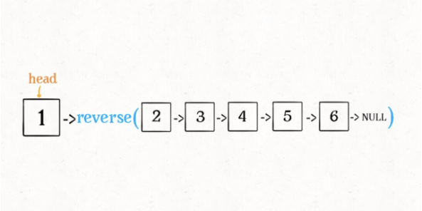
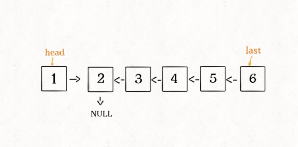
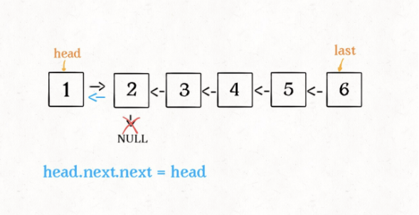
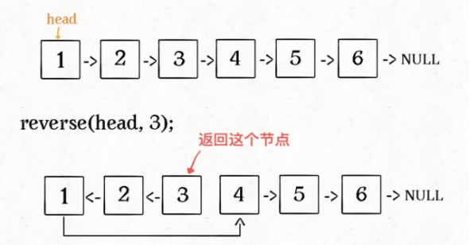

# 递归反转链表的一部分

反转单链表的迭代实现不是一个困难的事，但是递归实现有点难度，如果再加点难度，让你仅仅反转单链表中的一部分，用递归实现

```typescript
class ListNode {
  val: number;
  next: ListNode;
  function(x: number) {
    val = x;
  }
}
```

反转从位置 m 到 n 的链表。**这里的索引是从 1 开始的**。迭代的思路大概是：先用一个 for 循环找到第 m 个位置，然后再用一个 for 循环将 m 和 n 之间的元素反转。

迭代实现思路看起来虽然简单，但是细节问题很多，反而不容易写对。相反，递归实现就很简洁优美

## 一、递归反转整个链表

```typescript
function reverse(head: ListNode) {
  if (head == null || head.next === null) return head;
  let last = reverse(head.next);
  head.next.next = head;
  head.next = null;
  return last;
}
```

**输入一个节点 head，将[以 head 为起点]的链表反转，并返回反转之后的头节点**。

比如我们想反转这个链表：


输入 reverse(head)后，会在这里进行递归：

```typescript
last = reverse(head.next);
```

根据刚才的函数定义，弄清楚这段代码会产生什么结果：



reverse(head.next)执行完后，整个链表就成了这样：



根据函数定义，reverse 函数会返回反转之后的头结点，用变量 last 接收了。

看下面的代码：

```typescript
head.next.next = head;
```



接下来：

```typescript
head.next = null;
return last;
```


有两个地方需要注意：

1.递归函数要有 base case：

```typescript
if (head.next == null) return head;
```

如果链表只有一个节点的时候反转的也是它自己，直接返回即可

2.当链表递归反转之后，新的头节点是 last，而之前的 head 变成了最后一个节点，别忘了链表的末尾要指向 null：

```typescript
head.next = null;
```

## 反转链表前 N 个节点



```typescript
let successor = null; //后驱节点

// 反转以head为起点的n个节点，返回新的头节点
function reverseN(head: ListNode, n: number) {
  if (n == 1) {
    // 记录n+1个节点
    successor = head.next;
    return head;
  }

  // 以head.next为起点，需要反转前n-1个节点
  const last = reverseN(head.next, n - 1);

  head.next.next = head;
  // 让反转之后的head节点和后面的节点连起来
  head.next = successor;
  return last;
}
```

具体区别：

1.base case 变为 n == 1 ，反转一个元素，就是它本身，同时**要记录后驱节点**。

2.刚才我们直接把 head.next 设置为 null，因为整个链表反转后原来的 head 变成了整个链表的最后一个节点。但现在 head 节点在递归反转之后不一定是最后一个节点了，所以要记录后驱 successor(第 n+1 个节点)，反转之后将 head 连接上。


## 反转链表的一部分

给一个索引区间[m,n](索引从1开始)，仅仅反转区间中的链表元素

首先，如果 m ==1,就相当于反转链表开头的 n 个元素，即上面实现的功能。

```typescript
function reverseBetween(head, m, n) {
  //base case
  if (m == 1) {
    //相当于反转前n个元素
    return reverseN(head, n);
  }
}
```

如果 m!=1？我们把 head 的索引视为 1，那么我们是想从第 m 个元素开始反转；如果把 head.next 的索引视为 1 呢？那么相当于 head.next，反转的区间应该是从第 m-1 个元素开始的；那么对于 head.next.next 呢......

区别与迭代思想，这就是递归思想：

```typescript
function reverseBetween(head, m, n) {
  //base case
  if (m == 1) {
    //相当于反转前n个元素
    return reverseN(head, n);
  }
  // 前进到反转的起点触发base case
  head.next = reverseBetween(head.next, m - 1, n - 1);
  return head;
}
```

## 总结

递归的思想相对于迭代，稍微有点难理解，处理的技巧是：不要跳进递归，而是利用明确的定义来实现算法逻辑。

处理看起来比较困难的问题，可以尝试化整为零，把一些简单的解法进行修改，解决困难的问题。

递归操作链表并不高效。和迭代解法相比，虽然时间复杂度都是 o(N),但是迭代解法的空间复杂地是 O(1),而递归解法需要堆栈，空间复杂度是 O(N).
