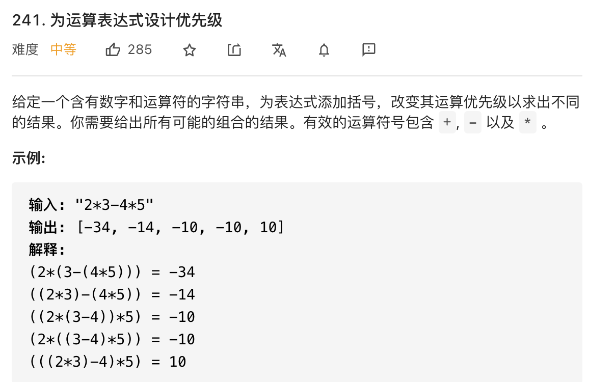

# 运算优先级

```typescript
/*
leecode:
241.为运算表达式设计优先级（中等）
*/
```

回溯、分治和动态规划算法可以划为一类，因为它们都会涉及递归。

回溯算法就一种简单粗暴的算法技巧，说白了就是一个暴力穷举算法，比如让你 用回溯算法求子集、全排列、组合，你就穷举呗，就考你会不会漏掉或者多算某些情况。

动态规划是一类算法问题，肯定是让你求最值的。因为动态规划问题拥有 最优子结构，可以通过状态转移方程从小规模的子问题最优解推导出大规模问题的最优解。

分治算法呢，可以认为是一种算法思想，通过将原问题分解成小规模的子问题，然后根据子问题的结果构造出原问题的答案。这里有点类似动态规划，所以说运用分治算法也需要满足一些条件，你的原问题结果应该可以通过合并子问题结果来计算。

其实这几个算法之间界定并没有那么清晰，有时候回溯算法加个备忘录似乎就成动态规划了，而分治算法有时候也可以加备忘录进行剪枝。

最典型的分治算法就是归并排序：

```typescript
function sort(nums: number[], lo: number, hi: number) {
  let mid = Math.floor((lo + hi) / 2);

  sort(nums, lo, mid);
  sort(nums, mid + 1, hi);
  merge(nums, lo, mid, hi);
}
```

## 添加括号的所有方式



简单说，**就是给你输入一个算式，你可以给它随意加括号，请你穷举出所有可能的加括号方式，并计算出对应的结果**。

关键点有两点：

- 1.**不要思考政体，而是把目光聚焦局部，只看一个运算符**

- 2.**明确递归函数的定义是什么，相信并且利用好函数的定义**

先举个例子：

1 + 2 _3 - 4_ 5

如果不让括号嵌套（即只加一层括号），有几种加括号的方式？

显然我们有四种加括号方式：

```typescript
/*
(1) + (2 * 3 - 4 * 5)

(1 + 2) * (3 - 4 * 5)  

(1 + 2 * 3) - (4 * 5)  

(1 + 2 * 3 - 4) * (5)  
*/
```

发现规律了么？其实就是按照运算符进行分割，给每个运算符的左右两部分加括号，这就是之前说的第一个关键点，不要考虑整体，而是聚焦每个运算符。

1 + 2 \* 3 可以有两种加括号的方式，分别是：

(1) + (2 \* 3) = 7

(1 + 2) \* (3) = 9

或者我们可以写成这种形式：

1 + 2 \* 3 = [9, 7]

而 4 _5 当然只有一种加括号方式，就是 4_ 5 = [20]。

然后呢，你能不能通过上述结果推导出 (1 + 2 x 3) - (4 x 5) 有几种加括号方式，或者说有几种不同的结果？

显然，可以推导出来 (1 + 2 x 3) - (4 x 5) 有两种结果，分别是：

9 - 20 = -11

7 - 20 = -13

对于 (1 + 2 x 3) - (4 x 5) 这个例子，我们的计算逻辑其实就是这段代码：

```typescript
function diffWaysToCompute("(1 + 2 * 3) - (4 * 5)"){
    let res=[]
    let left=diffWaysToCompute("(1 + 2 * 3)")
    let right=diffWaysToCompute("(4 * 5)")

    for (const a of left) {
        for (const b of right) {
            res.add(a-b)
        }
    }
    return res
}
```

对于列出的所有方式：

```typescript
/*
(1) + (2 * 3 - 4 * 5)

(1 + 2) * (3 - 4 * 5)  

(1 + 2 * 3) - (4 * 5)  

(1 + 2 * 3 - 4) * (5)  
*/
```

```typescript
let memo = new Map();

function diffWaysToCompute(input: string) {
  // 避免重复计算
  if (memo.has(input)) {
    return memo.get(input);
  }

  let res = [];
  for (let i = 0; i < input.length; i++) {
    let c = input[i];
    if (c == "-" || c == "*" || c == "+") {
      /****** 分 ******/
      // 以运算符为中心，分割成两个字符串，分别递归计算
      let left = diffWaysToCompute(input.substring(0, i));
      let right = diffWaysToCompute(input.substring(i + 1));
      /****** 治 ******/
      // 通过子问题的结果，合成原问题的结果
      for (const a of left) {
        for (const b of right) {
          if (c == "+") {
            res.push(a + b);
          } else if (c == "-") {
            res.add(a - b);
          } else if (c == "*") {
            res.add(a * b);
          }
        }
      }
    }
  }
  // base case
  // 如果 res 为空，说明算式是一个数字，没有运算符
  if (res.length == 0) {
    res.add(Number(input));
  }
  // 将结果添加进备忘录
  memo.set(input, res);
  return res;
}
```

**这就是典型的分治思路，先「分」后「治」，先按照运算符将原问题拆解成多个子问题，然后通过子问题的结果来合成原问题的结果**.
