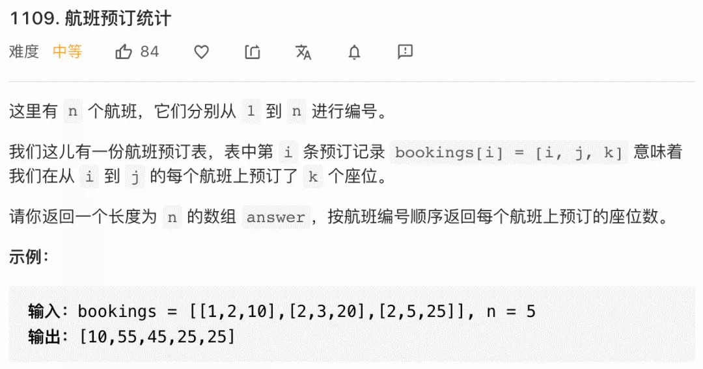

# 差分数组

```typescript
/*
leecode:
1109.航班预订统计（中等）
*/
```

**查分数组主要适用于频繁对原始数组的某个区间的元素进行增减**。

比如说，我给你输入一个数组 nums，然后又要求给区间 nums[2..6]全部加 1，再给 nums[3..9]全部减 3，再给 nums[0..4]全部加 2，再给…

一通操作猛如虎，然后问你，最后 nums 数组的值是什么？

常规的思路很容易，你让我给区间 nums[i..j]加上 val，那我就一个 for 循环给它们都加上呗，还能咋样？这种思路的时间复杂度是 O(N)，由于这个场景下对 nums 的修改非常频繁，所以效率会很低下。

这里就需要差分数组的技巧，类似前缀和技巧构造的 prefix 数组，我们先对 nums 数组构造一个 diff 差分数组，**diff[i]就是 nums[i]和 nums[i-1]之差**：

```typescript
let diff = Array.from({ length: nums.length });
diff[0] = nums[0];
for (let i = 1; i < nums.length; i++) {
  diff[i] = nums[i] - nums[i - 1];
}
```

通过 diff 差分数组可以反推出原始数组 nums：

```typescript
let res = Array.from({ length: diff.length });
res[0] = diff[0];
for (let i = 1; i < diff.length; i++) {
  res[i] = res[i - 1] + diff[i];
}
```

**这样构造差分数组 diff，就可以快速进行区间增减操作**，如果你想对区间 nums[i..j]的元素全部加 3，那么只需要让 diff[i]+=3,然后再让 diff[j+1]-=3 即可。

**原理很简单，回想 diff 数组反推 nums 数组的过程，diff[i] += 3 意味着给 nums[i..]所有的元素都加了 3，然后 diff[j+1] -= 3 又意味着对于 nums[j+1..]所有元素再减 3，那综合起来，是不是就是对 nums[i..j]中的所有元素都加 3 了？**

只要花费 O(1) 的时间修改 diff 数组，就相当于给 nums 的整个区间做了修改。多次修改 diff，然后通过 diff 数组反推，即可得到 nums 修改后的结果。

现在我们把差分数组抽象成一个类，包含 increment 方法和 result 方法：

```typescript
const diff = [];
function difference(nums: number[]) {
  if (nums.length == 0) return null;
  let diff = Array.from({ length: nums.length });
  // 构造差分数组
  diff[0] = nums[0];
  for (let i = 1; i < nums.length; i++) {
    diff[i] = nums[i] - nums[i - 1];
  }
}

// 给闭区间[i,j]增加val(可以为负数)
function increment(i: number, j: number, val: number) {
  diff[i] += val;
  if (j + 1 < diff.length) {
    // j+1 >= diff.length，说明是对nums[i]以及后面的整个数组都进行修改，那么就不需要再给diff数组减val了
    diff[j + 1] -= val;
  }
}

function result() {
  let res = Array.from({ length: diff.length });
  // 根据差分数组构造结果数组
  res[0] = diff[0];
  for (let i = 1; i < diff.length; i++) {
    res[i] = res[i - 1] + diff[i];
  }
  return res;
}
```

## 实践



给你输入一个长度问 n 的数组 nums，其中素有元素都是 0，再给你输入一个 bookings，里面是若干三元组(i,j,k)，每个三元组的含义就是要求你给 nums 数组的闭区间[i-1,j-1]中所有元素都加上 k。请你返回最后的 nums 数组是多少。

PS：因为题目说的 n 是从 1 开始计数的，而数组索引从 0 开始，所以对于输入的三元组(i,j,k)，数组区间应该对应[i-1,j-1]。

```typescript
function corpFlightBooking(bookings: number[][], n: number) {
  let nums = Array.from({ length: n });

  let diff = difference(bookings);

  for (const booking of bookings) {
    let i = booking[0] - 1;
    let j = booking[1] - 1;
    let val = booking[2];
    increace(i, j, val);
  }
  return result();
}
```
