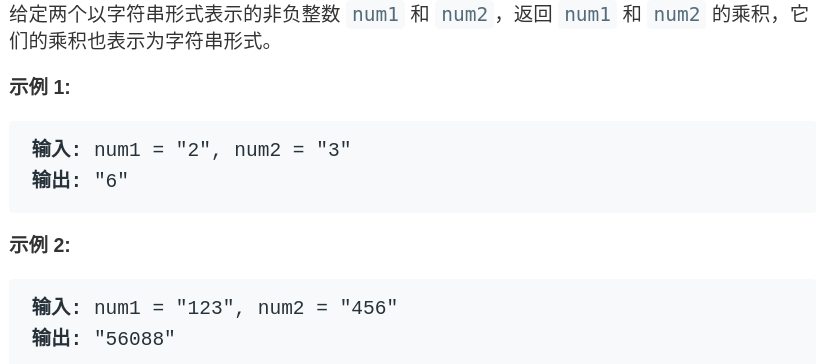
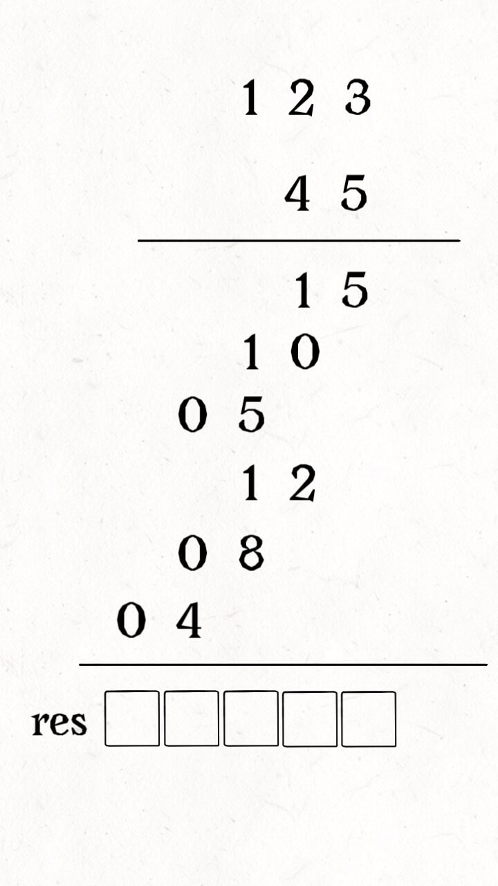

# 字符串相乘

```typescript
/*
leecode:
43.字符串相乘（中等）
*/
```

需要注意的是，num1 和 num2 可以非常长，所以不可以把他们直接转成整型然后运算，唯一的思路就是模仿我们手算乘法。



如果是个很大的数字的话，是无法直接计算乘积的。我们可以用一个数组在底下接收相加结果：



整个计算过程大概是这样，有两个指针 i，j 在 num1 和 num2 上游走，计算乘积，同时将乘积叠加到 res 的正确位置：

现在还有一个关键问题，如何将乘积叠加到 res 的正确位置，或者说，如何通过 i，j 计算 res 的对应索引呢？

其实，细心观察之后就发现，**num1[i] 和 num2[j] 的乘积对应的就是 res[i+j] 和 res[i+j+1] 这两个位置**。


```typescript
function multiply(num1: string, num2: string) {
  let m = num1.length,
    n = num2.length;

  // 结果最多为m + n位数
  const res = Array.from({ length: m + n }).map((i) => 0);

  // 从个位开始逐位相乘
  for (let i = m - 1; i >= 0; i--) {
    for (let j = n - 1; j >= 0; j--) {
      let mul = num1[i] * num2[j];
      // 乘积在res对应的索引位置
      let p1 = i + j,
        p2 = i + j + 1;
      // 叠加到res上
      // 向前进位
      let sum = mul + res[p2];
      res[p2] = sum % 10;
      res[p1] += sum / 10;
    }
  }
  // 结果前缀可能存的0(未使用的位)
  let i = 0;
  while (i < res.length && res[i] == 0) {
    i++;
  }

  // 将计算结果转化为字符串
  let str;

  for (; i < res.length; i++) {
    str.push(res[i].toString());
  }

  return str.length == 0 ? "0" : str;
}
```

优化写法

```typescript
function mulity(num1: number, num2: number) {
  let str1 = String(num1),
    str2 = String(num2);
  let l1 = str1.length,
    l2 = str2.length,
    p = new Array(l1 + l2).fill(0); // 长度为l1+l2，最后一位下角标为l1+l2-1,即初始化时(i=l1-1,j=l2-1)的i+j+1

  for (let i = l1 - 1; i >= 0; i--) {
    for (let j = l2 - 1; j >= 0; j--) {
      let temp = str1[i] * str2[j] + p[i + j + 1];
      p[i + j + 1] = temp % 10;
      p[i + j] += (temp / 10) | 0;
    }
  }

  while (p[0] === 0) {
    p.shift();
  }
  return p.join("");
}
```
