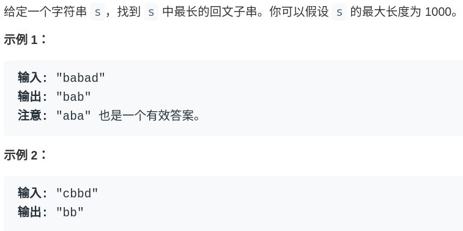

# 最长回文子串

```typescript
/*
leecode:
5.最长回文子串（中等）
*/
```

**回文串就是正着读和反着读都一样的字符串**。

比如说字符串 aba 和 abba 都是回文串，因为它们对称，反过来还是和本身一样。反之，字符串 abac 就不是回文串。

可以看到回文串的的长度可能是奇数，也可能是偶数，这就添加了回文串问题的难度，解决该类问题的核心是**双指针**。



## 一、思考

有一个很有趣的思路：既然回文串是一个正着反着读都一样的字符串，那么如果我们把 s 反转，称为 s'，然后在 s 和 s' 中寻找最长公共子串，这样应该就能找到最长回文子串。

比如说字符串 abacd，反过来是 dcaba，它的最长公共子串是 aba，也就是最长回文子串。

**但是这个思路是错误的**，比如说字符串 aacxycaa，反转之后是 aacyxcaa，最长公共子串是 aac，但是最长回文子串应该是 aa。

虽然这个思路不正确，但是**这种把问题转化为其他形式的思考方式是非常值得提倡的**。

正确思路：使用双指针。

**寻找回文串问题的核心思想是：从中间开始向两边扩散来判断回文串**。对于最长回文子串：

```typescript
(for 0<= i < s.length){
    找到以s[i]为中心的回文串
    更新答案
}
```

但是，回文串的长度可能是奇数也可能是偶数，如果是 abba 这种情况，没有一个中心字符，上面的算法就没辙了。所以需要做一下修改

```typescript
(for 0<= i < s.length){
    找到以s[i]为中心的回文串
    找到以s[i]和s[i+1]为中心的回文串
    更新答案
}
```

## 代码实现

```typescript
// 传入两个指针l和r，是因为这样实现可以同时处理回文串长度为奇数和偶数的情况
function palindrome(s: string, l: number, r: number) {
  // 防止索引越界
  while (l >= 0 && r < s.length && s[l] == s[r]) {
    // 向两边展开
    l--;
    r++;
  }
  // 返回以s[l]和s[r]为中心的最长回文串
  return s.substring(l + 1, r - l);
}

function longestPalindrome(s: string) {
  let res;
  for (let i = 0; i < s.length; i++) {
    // 以s[i]为中心的最长回文子串
    let s1 = palindrome(s, i, i);
    // 以s[i]和s[i+1]为中心的最长回文子串
    let s2 = palindrome(s, i, i + 1);
    // res = longest(res,s1,s2)
    res = res.length > s1.length ? res : s1;
    res = res.length > s2.length ? res : s2;
  }
  return res;
}
```

时间复杂度 O(N^2)，空间复杂度 O(1)
