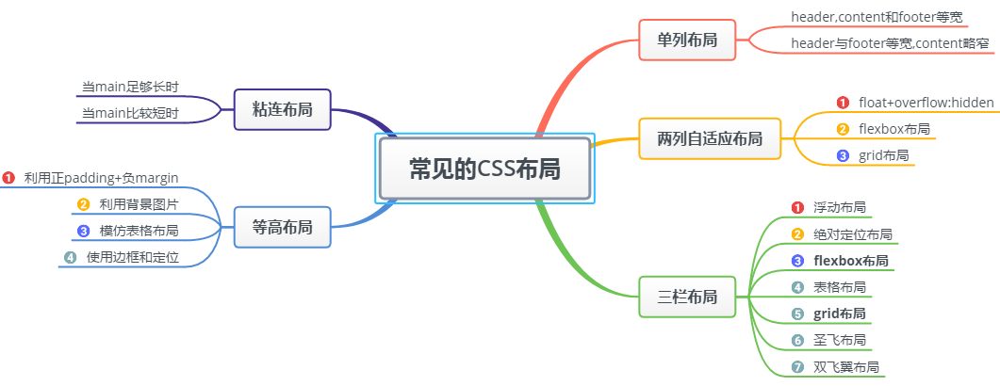
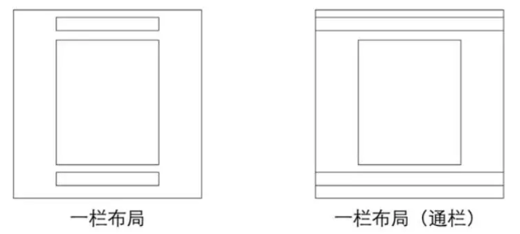
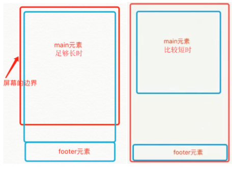

# 几种常见的CSS布局



## 一.单列布局



常见的单列布局有两种：

* header,content,footer等宽的单列布局
* header与footer等宽，content略窄的单列布局

### 如何实现

对于第一种，看通过对header,content,footer统一设置width：1000px,或者max-width：1000px（这两者的区别是当屏幕小于1000px时，前者会出现滚动条，后者则不会，显示出实际宽度）；然后设置margin：auto实现居中即可得到。

```html
<div class="header"></div>
<div class="content"></div>
<div class="footer"></div>

<style>
.header{
    margin:0 auto; 
    max-width: 960px;
    height:100px;
    background-color: blue;
}
.content{
    margin: 0 auto;
    max-width: 960px;
    height: 400px;
    background-color: aquamarine;
}
.footer{
    margin: 0 auto;
    max-width: 960px;
    height: 100px;
    background-color: aqua;
}
</style>
```

对于第二种，header，footer的内容宽度不设置，块级元素充满整个屏幕，但nav，content的内容区设置同一个width，并通过margin：auto实现居中

## 二.两列自适应布局

**两列自适应布局是指一列由内容撑开，另一列撑满剩余宽度的布局方式**。

### 1.float+overflow:hidden

如果是普通的两列布局，浮动+普通元素的margin便可以实现，但如果是自适应的两列布局，利用float+overflow:hidden便可以实现，这种办法主要是利用overflow触发BFC，而BFC不会重叠浮动元素，由于设置overflow:hidden并不会触发IE6浏览器的haslayout属性，所以需要设置zoom：1来兼容IE6浏览器

```html
<div class="parent" style="background-color: lightgrey;">
    <div class="left" style="background-color: lightblue;">
        <p>left</p>
    </div>
    <div class="right"  style="background-color: lightgreen;">
        <p>right</p>
        <p>right</p>
    </div>
</div>

<style>
.parent {
  overflow: hidden;
  zoom: 1;
}
.left {
  float: left;
  margin-right: 20px;
}
.right {
  overflow: hidden;
  zoom: 1;
}
</style>
```

**注意：如果侧边栏在右边时，注意渲染顺序，即在HTML中，先写侧边栏后写主内容**。

### 2.Flex布局

````css
//html部分同上
.parent {
  display:flex;
}  
.right {
  margin-left:20px;
  flex:1;
}
````

### 3.grid布局

```css
//html部分同上
.parent {
  display:grid;
  grid-template-columns:auto 1fr;
  grid-gap:20px
}
```

## 三.三栏布局

**中间列自适应宽度，旁边两侧固定宽度**。

这里只介绍圣杯布局和双飞翼布局
[圣杯布局和双飞翼布局](../css/圣杯布局和双飞翼布局.md)
[其他三栏布局](../css/三栏布局.md)

### 圣杯布局

比较特殊的三栏布局，同样是两边宽度固定，中间自适应，唯一的区别是dom结构必须是先写中间列部分，这样实现可以优先加载

```html
 <article class="container">
    <div class="center">
      <h2>圣杯布局</h2>
    </div>
    <div class="left"></div>
    <div class="right"></div>
</article>

<style>
  .container {
    padding-left: 220px;//为左右栏腾出空间
    padding-right: 220px;
  }
  .left {
    float: left;
    width: 200px;
    height: 400px;
    background: red;
    margin-left: -100%;
    position: relative;
    left: -220px;
  }
  .center {
    float: left;
    width: 100%;
    height: 500px;
    background: yellow;
  }
  .right {
    float: left;
    width: 200px;
    height: 400px;
    background: blue;
    margin-left: -200px;
    position: relative;
    right: -220px;
  }
</style>
```

缺点：

* center部分的最小宽度不能小于left部分，否则会left部分掉到下一行
* 如果其中一列内容高度拉长，其他两列的背景并不会自动填充（借助等高布局正padding+负margin可解决）

### 双飞翼布局

同样也是三栏布局，在圣杯布局基础上进一步优化，解决了圣杯布局错乱问题，实现了内容和布局的分离，而且任何一栏都可以是最高栏，不会出问题

```html
<article class="container">
    <div class="center">
        <div class="inner">双飞翼布局</div>
    </div>
    <div class="left"></div>
    <div class="right"></div>
</article>

<style>
    .container {
        min-width: 600px;//确保中间内容可以显示出来，两倍left宽+right宽
    }
    .left {
        float: left;
        width: 200px;
        height: 400px;
        background: red;
        margin-left: -100%;
    }
    .center {
        float: left;
        width: 100%;
        height: 500px;
        background: yellow;
    }
    .center .inner {
        margin: 0 200px; //新增部分
    }
    .right {
        float: left;
        width: 200px;
        height: 400px;
        background: blue;
        margin-left: -200px;
    }
</style>
```

缺点：

* **多加了一层dom节点树，增加渲染生成的计算量**。

### 两种布局实现方式对比：

* 两种方式都是把主列放在文档流最前面，使主列优先加载
* 两种布局方式在实现上也有相同之处，都是让三列浮动，然后通过负外边距形成三列布局
* 两种布局方式的不同之处在于如何处理中间主列的位置：
**圣杯布局是利用父容器的左右内边距+两个从列相对定位**  
**双飞翼布局是把主列嵌套在一个新的父级块中利用主列的左右外边距进行布局调整**

## 等高布局

等高布局是指子元素在父元素中高度相等的布局方式

### 1.利用正padding+负margin

我们通过等高布局便可解决圣杯布局的第二个缺点，因为背景是在padding区域显示的，**设置一个大数值的padding-bottom，再设置相同数值的负的margin-bottom，并在所有列外面加上一个容器，并设置overflow:hidden把溢出背景切掉**。这种可能实现多列等高布局，并且也能实现列与列之间分割线效果，结构简单，兼容所有浏览器。

````css
//新增代码
.center,
.left,
.right {
    padding-bottom: 10000px;
    margin-bottom: -10000px;
}
.container {
    padding-left: 220px;
    padding-right: 220px;
    overflow: hidden;//把溢出背景切掉
}
````

### 2.利用表格布局

这是一种非常简单，易于实现的方法，不过兼容性不好，在ie6-7无法正常运行

````html
<div class="container table">
    <div class="containerInner tableRow">
    <div class="column tableCell cell1">
        <div class="left aside">
        ....
        </div>
    </div>
    <div class="column tableCell cell2">
        <div class="content section">
            ...
        </div>
    </div>
    <div class="column tableCell cell3">
        <div class="right aside">
            ...
        </div>
    </div>
    </div>
</div>

<style>
.table {
  width: auto;
  min-width: 1000px;
  margin: 0 auto;
  padding: 0;
  display: table;
}
.tableRow {
  display: table-row;
}
.tableCell {
  display: table-cell;
  width: 33%;
}
.cell1 {
  background: #f00;
  height: 800px;
}
.cell2 {
  background: #0f0;
}
.cell3 {
  background: #00f;
}
</style>
````

### 3.使用边框和定位

这种方法是使用边框和绝对定位来实现一个假的高度相等列的效果，假如你需要实现一个两列等高布局，侧栏高度和主内容高度相同

````html
<div id="wrapper">
    <div id="mainContent">...</div>
    <div id="sidebar">...</div>
</div>

<style>
#wrapper {
  width: 960px;
  margin: 0 auto;
}
#mainContent {
  border-right: 220px solid #dfdfdf;
  position: absolute;
  width: 740px;
  height: 800px;  
  background: green;
}
#sidebar {
  background: #dfdfdf;
  margin-left: 740px;
  position: absolute;
  height: 800px;
  width: 220px;
}
</style>
````

## 粘连布局

### 特点

* 有一块<main>,当<main>的高度足够长的时候，紧跟在<main>后面的元素<footer>会跟在<main>元素后面
* 当<main>元素比较短的时候(比如小于屏幕的高度)，我们期望这个<footer>元素能够‘粘连’在屏幕的底部




### min-height实现

````html
<div id="wrap">
    <div class="main">
        main <br />
        main <br />
        main <br />
    </div>
</div>
<div id="footer">footer</div>
<style>
* {
    margin: 0;
    padding: 0;
}
html,
body {
    height: 100%;//高度一层层继承下来
}
#wrap {
    min-height: 100%;
    background: pink;
    overflow: hidden;
}
#wrap .main {
    padding-bottom: 50px;
}
#footer {
    height: 50px;
    line-height: 50px;
    background: deeppink;
    margin-top: -50px;
}
</style>
````

### flex实现

````css
body{
    min-height:100%;
    display:flex;
    flex-direction:column
}

.container{
    flex:1
}

.footer{
    height:100px;
}
````
