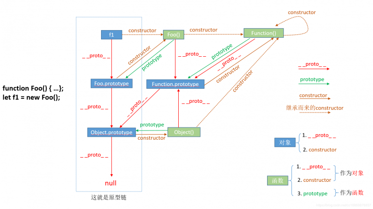
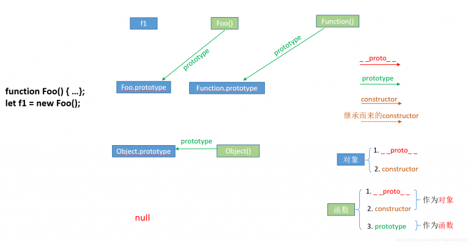
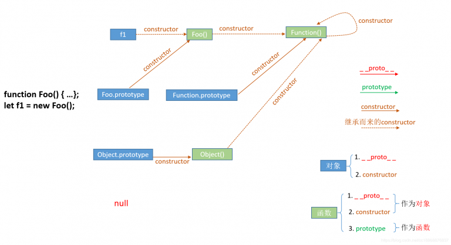
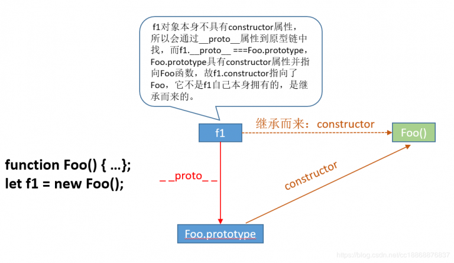

# JavaScript 中　 prototype \_\_proto\_\_ constructor 关系

## 两个最基本概念

> -\_\_proto\_\_和 constructor 属性是对象所独有的  
> -prototype 属性是函数独有的，因为函数也是一种对象，所以函数也拥有\_\_proto\_\_和 constructor 属性

## \_\_proto\_\_

> -该属性的作用就是当访问一个对象的属性的时候，如果该对象内部不存在这个属性，那么就会去它的\_\_proto\_\_属性所指的那个对象(父对象)里找，一直找到\_\_proto\_\_属性的终点 null,然后返回 undefined,再往上就相当于在 null 上取值，会报错.  
> -通过\_\_proto\_\_属性将对象连接起来的这条链路即我们所谓的原型链

## prototype

> -函数的 prototype 属性指向一个对象，这个对象正是调用该构造函数而创建的实例的原型。该属性的作用就是让该函数所实例化的对象们都可以找到公用的属性和方法，即 f1.\_\_proto\_\_===Foo.prototype

## constructor

> -该属性指向该对象的构造函数，每一个原型都有一个 constructor 属性指向关联的构造函数，所有函数(此时看成对象了)最终的构造函数都指向 Function

## 总的关系图

## \_\_proto\_\_关系图

> -\_\_proto\_\_属性都是由一个对象指向一个对象，即指向他们的原型对象(也可以理解为父对象)，它的作用就是当访问一个对象的属性时，如果该对象内部不存在这个属性，那么就会去它的\_\_proto\_\_ 属性所指向的那个对象（可以理解为父对象）里找，如果父对象也不存在这个属性，则继续往父对象的\_\_proto\_\_属性所指向的那个对象里找，如果还没找到，则继续往上找…直到原型链顶端 null，此时若还没找到，则返回 undefined，由以上这种通过\_\_proto\_\_属性来连接对象直到 null 的一条链即为我们所谓的原型链。

## prototype 关系图

> -prototype 为函数所独有的属性，它是从一个函数指向一个对象。它的含义是原型对象，也就是一个函数(其实所有函数都可以作为构造函数)所创建的实例的原型对象，即 f1.\_\_proto\_\_===Foo.prototype  
> -prototype 作用: **包含可以由特定类型的所有实例共享的属性和方法** ，也就是让该函数所实例化的对象们都可以找到公用的属性和方法。任何函数在创建的时候，其实会默认同时创建该函数的 prototype 对象

## constructor 关系图

> -constructor 属性从一个对象指向一个函数，即该对象的构造函数，每个对象都有构造函数(本身有或继承而来，继承而来的要结合\_\_proto\_\_属性查看比较清楚，如下图所示)　　 -上图可以看到 Function 对象比较特殊，其构造函数即它自己(因为 Function 可以看成一个函数，也可以是一个对象)，所有函数和对象最终都是由Ｆ unction 构造函数得来，所以 constructor 属性的终点就是 Function 这个函数
>
> **-单从 constructor 这个属性来讲，只有 prototype 对象才有.** 每个函数在创建的时候，js 会同时创建一个该函数对应的 prototype 对象，而 **函数创建的对象.\_\_proto\_\_ === 该函数.prototype,该函数.prototype.constructor === 该函数本身,** 故通过函数创建的对象即使自己没有 constructor 属性，它也能通过\_\_proto\_\_找到对应的 constructor，所以任何对象最终都可以找到其构造函数（null 如果当成对象的话，null 除外）

