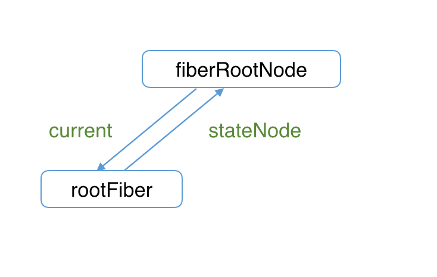

# ReactDOM render

## 创建 fiber

双缓存机制，首次执行 ReactDOM.render 会创建 fiberRootNode 和 rootFiber。其中 fiberRootNode 是整个应用的根节点，rootFiber 是要渲染组件所在组件树的根节点

这一步发生在 ReactDOM.render 后进入的 legacyRenderSubtreeIntoContainer 方法中

```typescript
// container指ReactDOM.render的第二个参数（即应用挂载的DOM节点）
root = container._reactRootContainer = legacyCreateRootFromDOMContainer(
  container,
  forceHydrate,
);
fiberRoot = root._internalRoot;
```

legacyCreateRootFromDOMContainer 方法内部会调用 createFiberRoot 方法完成 fiberRootNode 和 rootFiber 的创建以及关联。并初始化 UpdateQueue

```typescript
export function createFiberRoot(
  containerInfo: any,
  tag: RootTag,
  hydrate: boolean,
  hydrationCallbacks: null | SuspenseHydrationCallbacks,
): FiberRoot {
  // 创建fiberRootNode
  const root: FiberRoot = (new FiberRootNode(containerInfo, tag, hydrate): any);

  // 创建rootFiber
  const uninitializedFiber = createHostRootFiber(tag);

  // 连接rootFiber与fiberRootNode
  root.current = uninitializedFiber;
  uninitializedFiber.stateNode = root;

  // 初始化updateQueue
  initializeUpdateQueue(uninitializedFiber);

  return root;
}
```

rootFiber 到 fiberRootNode 的引用



## 创建 update

这一步发生在 updateContainer 方法中

```typescript
export function updateContainer(
  element: ReactNodeList,
  container: OpaqueRoot,
  parentComponent: ?React$Component<any, any>,
  callback: ?Function,
): Lane {
  // ...省略与逻辑不相关代码

  // 创建update
  const update = createUpdate(eventTime, lane, suspenseConfig);

  // update.payload为需要挂载在根节点的组件
  update.payload = { element };

  // callback为ReactDOM.render的第三个参数 —— 回调函数
  callback = callback === undefined ? null : callback;
  if (callback !== null) {
    update.callback = callback;
  }

  // 将生成的update加入updateQueue
  enqueueUpdate(current, update);
  // 调度更新
  scheduleUpdateOnFiber(current, lane, eventTime);

  // ...省略与逻辑不相关代码
}
```

update.payload={element};这就是对于 HostRoot，payload 为 ReactDOM.render 的第一个传参

## 流程概览

ReactDOM.render 的整体流程

```typescript
创建fiberRootNode、rootFiber、updateQueue（`legacyCreateRootFromDOMContainer`）

    |
    |
    v

创建Update对象（`updateContainer`）

    |
    |
    v

从fiber到root（`markUpdateLaneFromFiberToRoot`）

    |
    |
    v

调度更新（`ensureRootIsScheduled`）

    |
    |
    v

render阶段（`performSyncWorkOnRoot` 或 `performConcurrentWorkOnRoot`）

    |
    |
    v

commit阶段（`commitRoot`）
```

## React 的其他入口函数

当前 React 公有三种模式：

- legacy，这是当前 React 使用的方式。当前没有计划删除本模式，但这个模式可能不支持一些新功能

- blocking，开启部分 concurrent 模式特性的中间模式，目前正在实验中，作为迁移到 concurrent 模式的第一个步骤

- concurrent，面向未来的开发模式，我们之前讲到的 **任务中断/任务优先级** 都是针对 concurrent 模式
