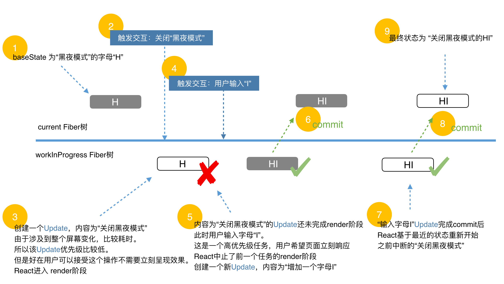

# 优先级

## 什么是优先级

**状态更新**由**用户交互**产生，用户心里对交互执行顺序有个预期。React 根据**人机交互研究的结果**中用户对交互的**预期顺序**为交互产生的**状态更新**赋予不同优先级；

- 生命周期方法：同步执行；

- 受控的用户输入：比如输入框内输入文字，同步执行；

- 交互事件：比如动画，高优先级执行

- 其他：比如数据请求，低优先级执行

## 如何调度优先级

React 通过 scheduler 调度任务。每当需要调度任务时，React 会调用 Scheduler 提供的方法 runWithPriority。

该方法接收一个**优先级常量**与一个**回调函数**作为参数。回调函数会**以优先级高低为顺序排列**在一个**定时器**中并在合适的时间触发。

对于更新来讲，传递的回调函数一般为状态更新流程概览一节讲到的**render 阶段的入口函数**

## 例子

优先级最终会反映到 update.lane 变量上。当前我们只需要知道这个变量能够区分 Update 的优先级。



有两个 Update。我们将”关闭黑夜模式“产生的 update 成为 u1，输入字母”I“产生的 Update 为 u2；

其中 u1 先触发并进入 render 阶段。其优先级较低，执行时间较长：

```typescript
fiber.updateQueue = {
  baseState: {
    blackTheme: true,
    text: "H",
  },
  firstBaseUpdate: null,
  lastBaseUpdate: null,
  shared: {
    pending: u1,
  },
  effects: null,
};
```

在 u1 完成 render 阶段前用户通过键盘输入字母”I“，产生了 u2，u2 属于**受控的用户输入**，优先级高于 u1，中断了 u1 产生的 render 阶段。

此时：

```typescript
fiber.updateQueue.shared.pending === u2 ----> u1
                                     ^        |
                                     |________|
// 即
u2.next === u1;
u1.next === u2;
```

其中 u2 优先级高于 u1.接下来进入 u2 产生的 render 阶段。

在 processUpdateQueue 方法中，shared.pending 环状链表会被剪开并拼接在 baseUpdate 后面。

需要明确的一点，shared.pending 指向最后一个 pending 的 update，所以实际执行时 update 的顺序为：

```typescript
u1 -- u2
```

接下来遍历 baseUpdate,处理优先级合适的 Upadte（这一次处理的是优先级高的 u2）。

由于 u2 不是 baseUpdate 中的第一个 update，在其之前的 u1 由于优先级不够被跳过。

update 之间可能有依赖关系，所以被跳过的 update 及其后面所有 update 会成为下次更新的 baseUpdate。（即 u1--u2）

最终 u2 完成 render-commit 阶段

此时：

```typescript
fiber.updateQueue = {
  baseState: {
    blackTheme: true,
    text: "HI",
  },
  firstBaseUpdate: u1,
  lastBaseUpdate: u2,
  shared: {
    pending: null,
  },
  effects: null,
};
```

在 commit 阶段结尾会再调度一次更新，在该次更新中会基于 baseState 中 firstBaseUpdate 保存的 u1，开启一次新的 render 阶段。

最终两次 update 都完成后的结果如下:

```typescript
fiber.updateQueue = {
  baseState: {
    blackTheme: false,
    text: 'HI'
  },
  firstBaseUpdate: null,
  lastBaseUpdate: null
  shared: {
    pending: null
  },
  effects: null
};
```

我们可以看见，u2 对应的更新由于中断导致执行了两次，相应的 render 阶段的生命周期钩子 componentWillxxx 也会触发两次。这也是为什么这些钩子会被标记为 unsafe\_。

## 如何保证状态正确

- render 阶段可能被中断。如何保证 updateQueue 中保存的 Update 不丢失？

- 有时候当前状态需要依赖前一个状态。如何在支持跳过低优先级状态的同时保证状态依赖的连续性？

### 如何保证 update 不丢失

在 render 阶段，shared.pending 的环被剪开并连接在 updateQue.lastBaseUpdate 后面。

实际上 shared.pending 会被同时连接在 workInProgress updateQueue.lastBaseUpdate 与 current updateQueue.lastBaseUpdate 后面

当 render 阶段被中断后重新开始时，会基于 current updateQueue 克隆出 workInProgress updateQ。由于 current UpdateQueue.lastBaseUpdate 已经保存了上一次 Update，所以不会丢失

当 commit 阶段完成渲染，由于 workInProgress updateQueue.lastBaseUpdate 中保存了上一次的 update，所以 workInProgress Fiber 树变成 current Fiber 树后也不会造成 update 的丢失

### 如何保证状态依赖的连续性

当某个 Update 由于优先级低而被跳过时，保存在 baseUpdate 中的不仅是该 Update，还包括链表中该 Update 之后的所有 Update。

例子：

```typescript
baseState: ''
shared.pending: A1 --> B2 --> C1 --> D2
```

其中字母嗲表该 Update 要在页面插入的字母，数字代表优先级，值越低优先级越高。第一次 render，优先级为 1

```typescript
baseState: "";
baseUpdate: null;
render阶段使用的Update: [A1, C1];
memoizedState: "AC";
```

其中 B2 由于优先级为 2，所以他及其后面的所有 Update 会被保存在 baseUpdate 中作为下次更新的 update（即 B2 C1 D2）

这么做是为了保持状态的前后依赖顺序

第二次 render，优先级为 2

```typescript
baseState: "A";
baseUpdate: B2-- > C1-- > D2;
render阶段使用的Update: [B2, C1, D2];
memoizedState: "ABCD";
```

这里的 baseState 并不是上一次更新的 memoizedState。这是由于 B2 被跳过了

即当有 Update 被跳过时，下次更新的 baseState !== 上次更新的 memoizedState

通过以上例子我们可以发现，React 保证最终的状态一定和用户触发的交互一致，但是中间过程状态可能由于设备不同而不同。
